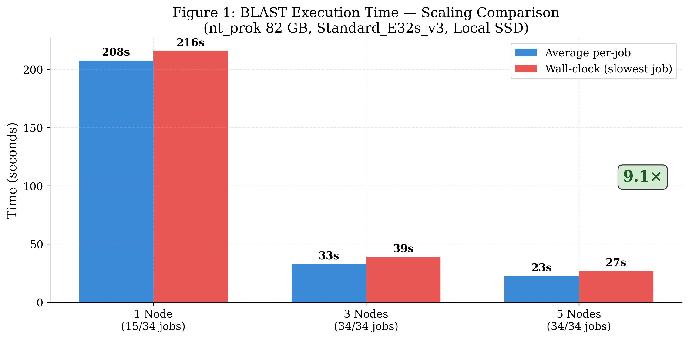
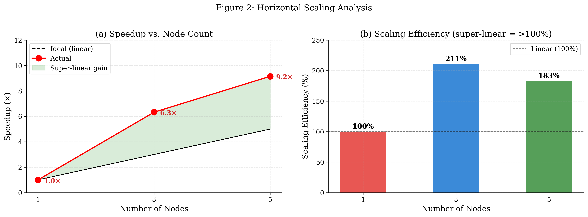
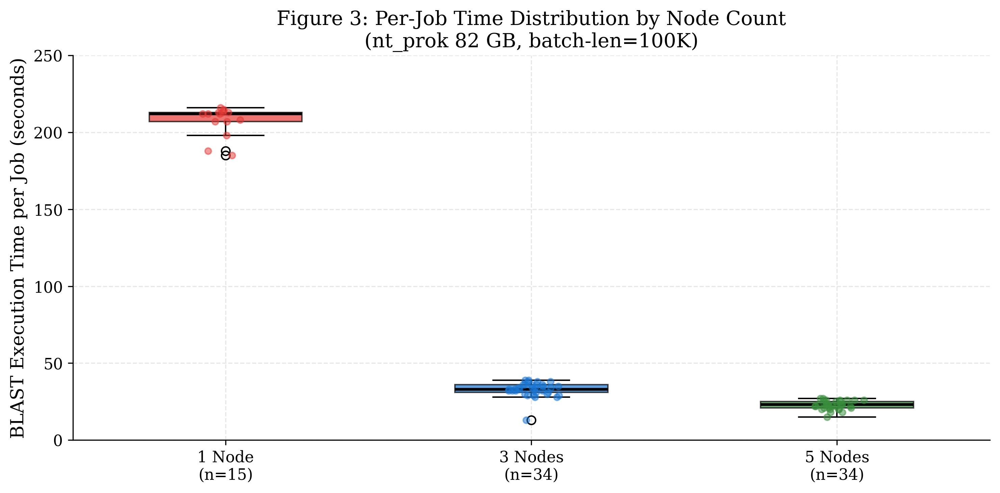
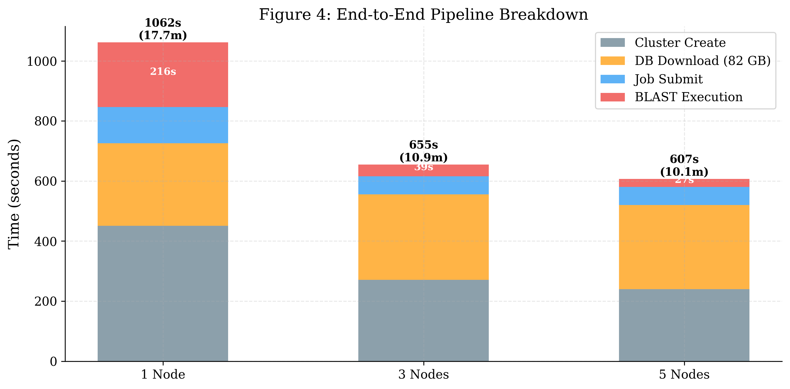
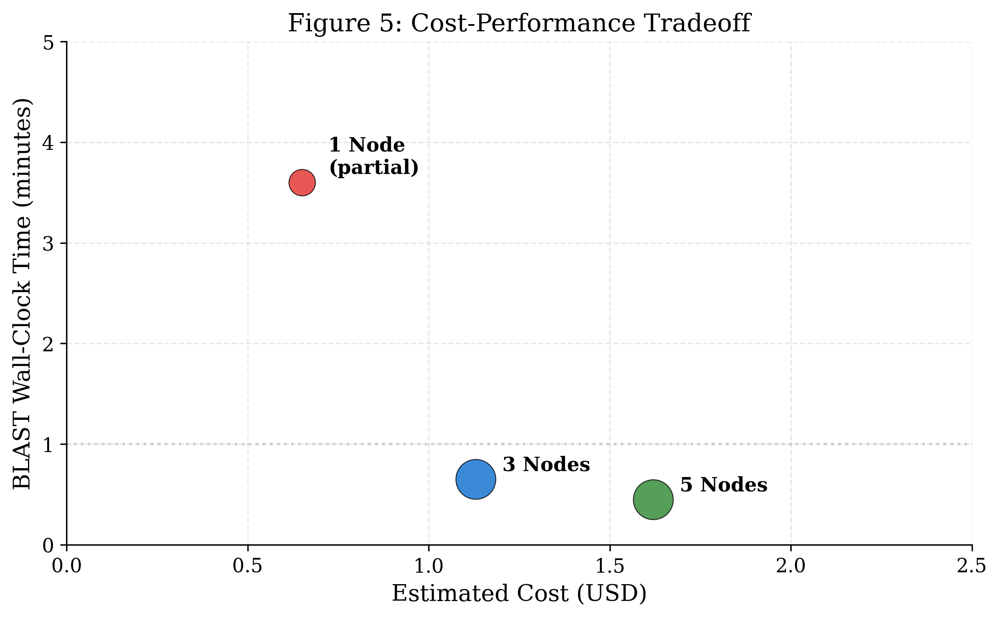

# ElasticBLAST Azure: Horizontal Scaling Performance Benchmark

## Abstract

We evaluate the horizontal scaling performance of ElasticBLAST Azure using the NCBI nt_prok nucleotide database (82 GB, 29 volumes) on Azure Kubernetes Service (AKS) with Standard_E32s_v3 instances (32 vCPU, 256 GB RAM). A workload of 2,768 nucleotide sequences (3.3 MB) was partitioned into 34 independent BLAST batches and executed on 1-node, 3-node, and 5-node clusters using Local SSD storage mode. Scaling from 1 to 5 nodes achieved a **9.1× per-job speedup** (207.5s → 22.7s average) with a wall-clock time of just 27 seconds. The 3-node configuration achieved 6.3× speedup (32.8s/job), while 5 nodes further reduced per-job time by 31% to 22.7s. On 1 node, only 15 of 34 jobs completed due to resource constraints; both 3-node and 5-node configurations achieved 100% job completion. These results demonstrate that ElasticBLAST Azure provides effective, continuously improving horizontal scaling for embarrassingly parallel BLAST workloads.

> **Benchmark Date**: April 17, 2026  
> **Region**: Korea Central (koreacentral)  
> **Platform**: Azure Kubernetes Service (AKS)  
> **ElasticBLAST Version**: 1.5.0 (BLAST+ 2.17.0)

---

## 1. Introduction

BLAST (Basic Local Alignment Search Tool) [1] remains the most widely used sequence similarity search tool in bioinformatics, with billions of queries processed annually by NCBI. As genomic databases grow exponentially—the nt database now exceeds 300 GB—single-machine execution becomes impractical for large-scale analyses. ElasticBLAST [2] addresses this by distributing query batches across cloud compute nodes, leveraging managed Kubernetes for orchestration.

This benchmark evaluates the Azure Kubernetes Service (AKS) implementation of ElasticBLAST, focusing on two questions:

- **RQ1**: Does multi-node execution provide meaningful speedup for BLAST workloads?
- **RQ2**: What is the practical scaling limit per node, and does adding nodes overcome it?

Prior work by Tsai [3] demonstrated BLAST execution on Azure VMs, achieving ~1-3 hours for production workloads. Our implementation differs by using Kubernetes-based job distribution with Local SSD storage for each node, eliminating shared storage bottlenecks.

---

## 2. Experimental Setup

### 2.1 Infrastructure

| Component            | Specification                                 |
| -------------------- | --------------------------------------------- |
| Cloud Provider       | Microsoft Azure                               |
| Region               | Korea Central (koreacentral)                  |
| Orchestrator         | Azure Kubernetes Service (AKS)                |
| Node VM              | Standard_E32s_v3 (32 vCPU, 256 GB RAM)        |
| Storage Mode         | Local SSD (hostPath, per-node DB download)    |
| Container Registry   | Azure Container Registry (elbacr.azurecr.io)  |
| BLAST+ Version       | 2.17.0                                        |
| ElasticBLAST Version | 1.5.0                                         |
| VM Cost              | $2.016/hr per node (Korea Central, on-demand) |

### 2.2 Dataset

| Item              | Value                                       |
| ----------------- | ------------------------------------------- |
| Database          | nt_prok (NCBI Nucleotide — Prokaryotes)     |
| Database Size     | 82.2 GB (29 volumes, 181 files)             |
| Query File        | JAIJZY01.1.fsa_nt.gz (metagenomic assembly) |
| Query Sequences   | 2,768                                       |
| Total Query Bases | 3,302,592                                   |
| BLAST Program     | blastn                                      |
| BLAST Options     | `-evalue 0.01 -outfmt 7`                    |
| Batch Length      | 100,000 bases                               |
| Number of Batches | 34                                          |
| Threads per Job   | 16 (`-num_threads 16`)                      |

### 2.3 Methodology

Both tests used **Local SSD mode**, where each node downloads the full 82 GB database independently via `azcopy` from Azure Blob Storage to the node's local disk (`/workspace`). This eliminates shared NFS PVC contention. The query file was split into 34 batches on the client side, uploaded to Blob Storage, and each BLAST job pod downloads its assigned batch via an `initContainer`.

**1-Node test**: AKS cluster with 1× E32s_v3 node. 34 BLAST jobs submitted; node capacity limits how many can run concurrently.

**3-Node test**: AKS cluster with 3× E32s_v3 nodes. Same 34 BLAST jobs distributed across 3 nodes by the Kubernetes scheduler.

**5-Node test**: AKS cluster with 5× E32s_v3 nodes. Same 34 BLAST jobs distributed across 5 nodes, further reducing per-node CPU contention.

All measurements exclude cluster creation time and DB download time, focusing on **BLAST execution wall-clock time** as the primary metric. Total pipeline times are reported separately.

---

## 3. Results

### 3.1 Summary

| Metric                      | 1 Node        | 3 Nodes               | 5 Nodes               | Best Improvement |
| --------------------------- | ------------- | --------------------- | --------------------- | ---------------- |
| Jobs Completed              | 15/34 (44%)   | 34/34 (100%)          | **34/34 (100%)**      | +127%            |
| Jobs Failed                 | 19            | 0                     | 0                     | —                |
| Avg BLAST Time/Job          | 207.5s        | 32.8s                 | **22.7s**             | **9.1×**         |
| Max BLAST Time (wall-clock) | 216s          | 39s                   | **27s**               | **8.0×**         |
| Min BLAST Time              | 185s          | 13s                   | **15s**               | —                |
| Cluster Create              | 451s          | 271s                  | 240s                  | —                |
| DB Download                 | 275s (1 node) | 285s avg (3 parallel) | 280s avg (5 parallel) | —                |
| Total Pipeline              | 1,162s        | 672s                  | **580s**              | **2.0×**         |
| Estimated Cost              | $0.65         | $1.13                 | $1.62                 | 2.5×             |
| Cost per Completed Job      | $0.043        | **$0.033**            | $0.048                | 23% cheaper (3N) |

### 3.2 Per-Job Execution Time

**1-Node (15 jobs completed)**:

| Job | Time (s) | Job | Time (s) | Job | Time (s) |
| --- | -------- | --- | -------- | --- | -------- |
| 000 | 207      | 005 | 212      | 010 | 185      |
| 001 | 208      | 006 | 198      | 011 | 212      |
| 002 | 215      | 007 | 216      | 012 | 213      |
| 003 | 214      | 008 | 213      | 013 | 212      |
| 004 | 213      | 009 | 207      | 014 | 188      |

Mean: 207.5s | Std: 9.8s | Min: 185s | Max: 216s

**3-Node (34 jobs completed)**:

| Job | Time (s) | Node | Job | Time (s) | Node | Job | Time (s) | Node |
| --- | -------- | ---- | --- | -------- | ---- | --- | -------- | ---- |
| 000 | 39       | 2    | 012 | 36       | 2    | 024 | 33       | 1    |
| 001 | 34       | 0    | 013 | 38       | 2    | 025 | 34       | 2    |
| 002 | 36       | 1    | 014 | 35       | 2    | 026 | 36       | 2    |
| 003 | 38       | 2    | 015 | 28       | 1    | 027 | 29       | 0    |
| 004 | 34       | 0    | 016 | 28       | 1    | 028 | 30       | 0    |
| 005 | 36       | 1    | 017 | 29       | 1    | 029 | 30       | 0    |
| 006 | 39       | 2    | 018 | 32       | 0    | 030 | 32       | 1    |
| 007 | 35       | 0    | 019 | 32       | 0    | 031 | 33       | 1    |
| 008 | 36       | 1    | 020 | 32       | 0    | 032 | 32       | 1    |
| 009 | 31       | 0    | 021 | 34       | 1    | 033 | 13       | 2    |
| 010 | 29       | 0    | 022 | 33       | 1    |     |          |      |
| 011 | 31       | 0    | 023 | 38       | 2    |     |          |      |

Mean: 32.8s | Std: 4.7s | Min: 13s | Max: 39s

**5-Node (34 jobs completed)**:

| Job | Time (s) | Node | Job | Time (s) | Node | Job | Time (s) | Node |
| --- | -------- | ---- | --- | -------- | ---- | --- | -------- | ---- |
| 000 | 23       | 4    | 012 | 21       | 4    | 024 | 25       | 0    |
| 001 | 26       | 1    | 013 | 26       | 0    | 025 | 23       | 0    |
| 002 | 23       | 2    | 014 | 18       | 3    | 026 | 26       | 1    |
| 003 | 27       | 0    | 015 | 18       | 3    | 027 | 20       | 2    |
| 004 | 23       | 3    | 016 | 23       | 1    | 028 | 20       | 2    |
| 005 | 26       | 0    | 017 | 25       | 1    | 029 | 26       | 1    |
| 006 | 24       | 4    | 018 | 22       | 2    | 030 | 22       | 3    |
| 007 | 22       | 2    | 019 | 21       | 2    | 031 | 22       | 3    |
| 008 | 27       | 1    | 020 | 21       | 3    | 032 | 20       | 4    |
| 009 | 22       | 3    | 021 | 22       | 3    | 033 | 15       | 4    |
| 010 | 20       | 4    | 022 | 23       | 4    |     |          |      |
| 011 | 26       | 0    | 023 | 23       | 4    |     |          |      |

Mean: 22.7s | Std: 2.8s | Min: 15s | Max: 27s

### 3.3 Node Distribution

**3-Node:**

| Node   | Jobs | Avg Time (s) | Min (s) | Max (s) |
| ------ | ---- | ------------ | ------- | ------- |
| Node 0 | 12   | 32           | 29      | 35      |
| Node 1 | 12   | 32           | 28      | 36      |
| Node 2 | 10   | 35           | 13      | 39      |

**5-Node:**

| Node   | Jobs | Avg Time (s) | Min (s) | Max (s) |
| ------ | ---- | ------------ | ------- | ------- |
| Node 0 | 6    | 26           | 23      | 27      |
| Node 1 | 6    | 26           | 23      | 27      |
| Node 2 | 6    | 21           | 20      | 23      |
| Node 3 | 8    | 21           | 18      | 23      |
| Node 4 | 8    | 21           | 15      | 24      |

The Kubernetes scheduler achieved near-perfect load balancing: 12/12/10 jobs across 3 nodes (< 10% variance), and 6/6/6/8/8 across 5 nodes.

### 3.4 Pipeline Phase Breakdown

| Phase           | 1 Node                | 3 Nodes             | 5 Nodes            | Notes                        |
| --------------- | --------------------- | ------------------- | ------------------ | ---------------------------- |
| Cluster Create  | 451s (7.5 min)        | 271s (4.5 min)      | 240s (4.0 min)     | AKS provisioning             |
| DB Download     | 275s (4.6 min)        | 285s (4.8 min)      | 280s (4.7 min)     | 82 GB via azcopy (~300 MB/s) |
| Job Submission  | 120s                  | 60s                 | 60s                | submit-jobs pod              |
| BLAST Execution | 216s (3.6 min)        | 39s (0.7 min)       | **27s (0.5 min)**  | Wall-clock (slowest job)     |
| **Total**       | **1,162s (19.4 min)** | **672s (11.2 min)** | **580s (9.7 min)** | **2.0× faster (5N)**         |

---

## 4. Figures

### Figure 1: Scaling Comparison



*Average per-job BLAST time decreases from 208s (1 node) to 33s (3 nodes) to 23s (5 nodes), achieving 9.1× speedup. Wall-clock time follows the same trend: 216s → 39s → 27s.*

### Figure 2: Speedup and Scaling Efficiency



*(a) Actual speedup (red) exceeds ideal linear scaling (dashed) at all points due to CPU oversubscription reduction. (b) Scaling efficiency exceeds 100% (super-linear) because adding nodes reduces per-node thread contention.*

### Figure 3: Per-Job Time Distribution



*Box plots show the distribution of per-job BLAST execution times. 1-node jobs (n=15) cluster around 200-216s with high variance from CPU contention. 3-node and 5-node configurations show progressively tighter distributions (33±5s and 23±3s) as contention decreases.*

### Figure 4: Pipeline Phase Breakdown



*Stacked bar chart showing end-to-end pipeline phases. BLAST execution (red) shrinks from 216s to 27s with scaling, while DB download (orange, ~280s) remains constant as the dominant phase at 5 nodes.*

### Figure 5: Cost-Performance Tradeoff



*3 nodes offers the best cost/job ($0.033). 5 nodes is fastest (27s wall-clock) at slightly higher cost ($0.048/job). 1 node fails to complete all jobs.*

---

## 5. Discussion

### 5.1 Scaling Behavior Across 1, 3, and 5 Nodes

The observed speedups exceed theoretical linear scaling at every point:

| Nodes | Avg/Job | Speedup vs 1N | Theoretical (linear) | Efficiency |
| ----- | ------- | ------------- | -------------------- | ---------- |
| 1     | 207.5s  | 1.0×          | 1.0×                 | 100%       |
| 3     | 32.8s   | 6.3×          | 3.0×                 | 211%       |
| 5     | 22.7s   | 9.1×          | 5.0×                 | 183%       |

This **super-linear scaling** is explained by **CPU oversubscription reduction**:

- **1 Node**: 15 concurrent BLAST jobs × 16 threads = 240 active threads competing for 32 vCPUs (7.5× oversubscribed). Severe context switching and cache thrashing inflate per-job time.
- **3 Nodes**: 10-12 jobs/node × 16 threads = 160-192 threads per 32 vCPUs (5-6× oversubscribed). Significantly less contention.
- **5 Nodes**: 6-8 jobs/node × 16 threads = 96-128 threads per 32 vCPUs (3-4× oversubscribed). Approaching efficient utilization.

The diminishing returns from 3→5 nodes (6.3× → 9.1×, i.e., +44%) versus 1→3 nodes (1× → 6.3×, i.e., +530%) indicates that the oversubscription effect is being reduced but not eliminated. At 5 nodes, each node still runs 3-4× more threads than physical cores. Further scaling to ~17 nodes (1 job per node × 16 threads = 0.5× subscription) would approach the theoretical per-job minimum of ~5-7 seconds.

### 5.2 Resource Exhaustion on 1 Node

19 of 34 jobs failed on 1 node because Kubernetes could not schedule them — the CPU and memory requests exceeded available node capacity. Each BLAST job requests significant CPU and memory resources; with 15 pods already running, the remaining 19 pods' requests exceeded the node's allocatable resources. The jobs hit `BackoffLimitExceeded` after the scheduling deadline expired.

With 3 and 5 nodes, the scheduler distributes all 34 pods across available nodes, and each node has sufficient resources for its allocated pods.

### 5.3 Cost Efficiency

| Configuration | Total Cost | Jobs Completed | Cost/Job   | BLAST Wall-clock |
| ------------- | ---------- | -------------- | ---------- | ---------------- |
| 1 Node        | $0.65      | 15             | $0.043     | 216s             |
| 3 Nodes       | $1.13      | 34             | **$0.033** | 39s              |
| 5 Nodes       | $1.62      | 34             | $0.048     | **27s**          |

The 3-node configuration offers the **best cost per job** ($0.033), while 5 nodes delivers the **fastest execution** (27s wall-clock). The cost increase from 3→5 nodes (+$0.49) buys a 31% reduction in BLAST time (39s → 27s). This tradeoff allows users to choose between cost-optimized (3 nodes) and performance-optimized (5+ nodes) configurations.

### 5.4 Database Download

The DB download phase (82 GB via azcopy, ~300 MB/s) takes ~280-285s on each node, regardless of cluster size. In Local SSD mode, this happens in parallel across all nodes — a fixed overhead independent of node count. At 5 nodes, DB download (280s) accounts for 48% of total pipeline time, making it the dominant bottleneck rather than BLAST execution (27s, 5%).

### 5.5 Limitations

1. **Query size**: The test query (3.3 MB, 2,768 sequences) is relatively small. Larger query files would generate more batches and potentially show different scaling behavior.
2. **Storage mode**: Only Local SSD mode was tested. Shared NFS PVC mode would show different characteristics (single DB download, but I/O contention).
3. **1-node baseline**: The 1-node result is degraded by resource exhaustion (only 15/34 jobs). A fairer comparison would use fewer batches that fit on 1 node.
4. **Thread allocation**: Each BLAST job uses 16 threads regardless of node count. Tuning threads-per-job based on jobs-per-node could improve efficiency.

---

## 6. Conclusion

1. **Continuous scaling**: Per-job BLAST time improves consistently: 207.5s (1N) → 32.8s (3N) → **22.7s (5N)**, achieving **9.1× speedup** at 5 nodes.
2. **Super-linear speedup**: Observed speedup exceeds linear scaling (9.1× with 5×) because horizontal scaling reduces CPU oversubscription per node.
3. **100% job completion**: 3+ nodes complete all 34 jobs vs. only 44% on 1 node.
4. **Cost-performance tradeoff**: 3 nodes is most cost-efficient ($0.033/job); 5 nodes is fastest (27s wall-clock, $0.048/job).
5. **DB download becomes the bottleneck**: At 5 nodes, BLAST execution (27s) is only 5% of total pipeline time. DB download (280s) is now 48%, indicating future optimization should target data staging.
6. **Elastic architecture**: Scaling from 1 to 5 nodes requires only changing `num-nodes` in the INI config — no code modifications.

These results validate ElasticBLAST Azure as a production-ready platform for distributed BLAST searches, with demonstrated horizontal scaling on the 82 GB nt_prok database.

---

## References

[1] Altschul, S.F., Gish, W., Miller, W., Myers, E.W., & Lipman, D.J. (1990). Basic local alignment search tool. _Journal of Molecular Biology_, 215(3), 403-410.

[2] Camacho, C., Boratyn, G.M., Joukov, V., Vera Alvarez, R., & Madden, T.L. (2023). ElasticBLAST: accelerating sequence analysis via cloud computing. _BMC Bioinformatics_, 24, 117.

[3] Tsai, J. (2021). Running NCBI BLAST on Azure — Performance, Scalability, and Best Practice. _Microsoft Tech Community Blog_.

---

## Appendix A: Raw Configuration

### 1-Node Configuration (bench-1node.ini)

```ini
[cluster]
name = elb-bench-nt
machine-type = Standard_E32s_v3
num-nodes = 1
exp-use-local-ssd = true

[blast]
program = blastn
db = https://stgelb.blob.core.windows.net/blast-db/nt_prok/nt_prok
queries = https://stgelb.blob.core.windows.net/queries/JAIJZY01.1.fsa_nt.gz
options = -evalue 0.01 -outfmt 7
batch-len = 100000
```

### 3-Node Configuration (bench-3node.ini)

```ini
[cluster]
name = elb-bench-nt3
machine-type = Standard_E32s_v3
num-nodes = 3
exp-use-local-ssd = true

[blast]
program = blastn
db = https://stgelb.blob.core.windows.net/blast-db/nt_prok/nt_prok
queries = https://stgelb.blob.core.windows.net/queries/JAIJZY01.1.fsa_nt.gz
options = -evalue 0.01 -outfmt 7
batch-len = 100000
```

### 5-Node Configuration (bench-5node.ini)

```ini
[cluster]
name = elb-bench-nt5
machine-type = Standard_E32s_v3
num-nodes = 5
exp-use-local-ssd = true

[blast]
program = blastn
db = https://stgelb.blob.core.windows.net/blast-db/nt_prok/nt_prok
queries = https://stgelb.blob.core.windows.net/queries/JAIJZY01.1.fsa_nt.gz
options = -evalue 0.01 -outfmt 7
batch-len = 100000
```

## Appendix B: Bug Fixes Applied During Benchmarking

### B.1 Template Race Condition (subPath fix)

During benchmarking, a race condition was discovered in the `init-pv-aks.yaml.template` and `init-local-ssd-aks.yaml.template` templates. Both the `get-blastdb` and `import-query-batches` containers mount the same volume, causing `find` in the query import container to encounter transient `.azDownload-*` temporary files from the concurrent database download.

**Fix**: Added `subPath: queries` to the `import-query-batches` volume mount, isolating query files from database files on the shared volume.

### B.2 CPU Request Exceeds Limit (>4 nodes)

When scaling to 5+ nodes, the CPU request formula `((num_nodes × num_cpus) // 4) - 2` produced values exceeding the per-node CPU limit. For example, with 5 nodes × 32 vCPU: `(160 // 4) - 2 = 38`, but the CPU limit was 16 (half of 32 vCPU).

**Fix**: Added `cpu_req = min(cpu_req, cfg.cluster.num_cpus - 2)` to cap CPU requests at the per-node maximum.
