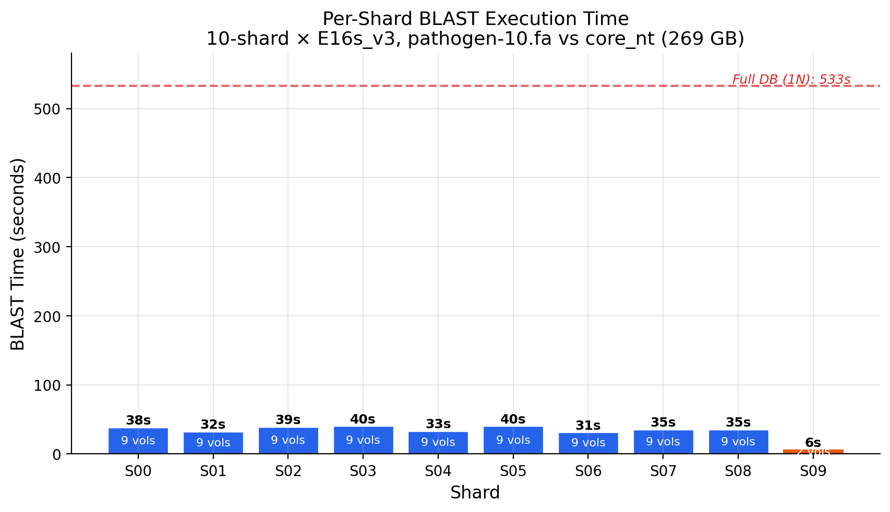
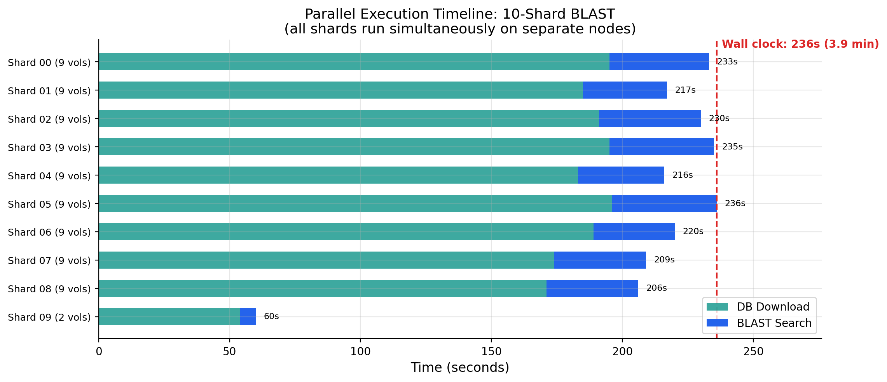
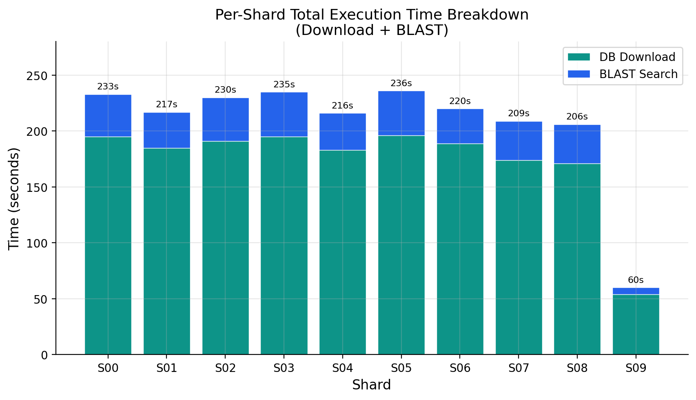
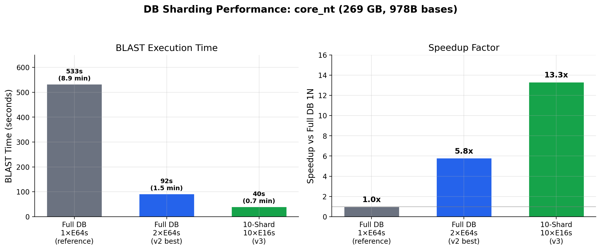
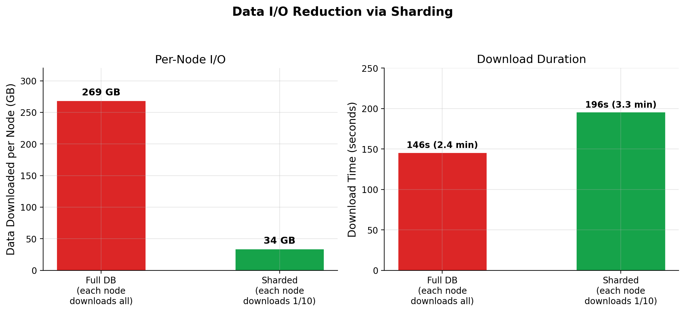
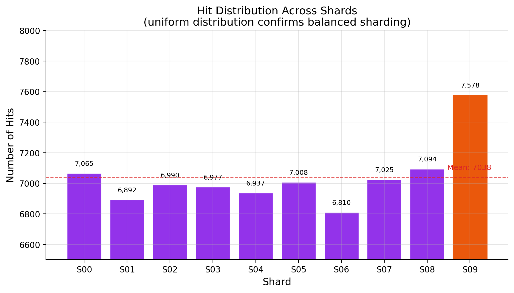
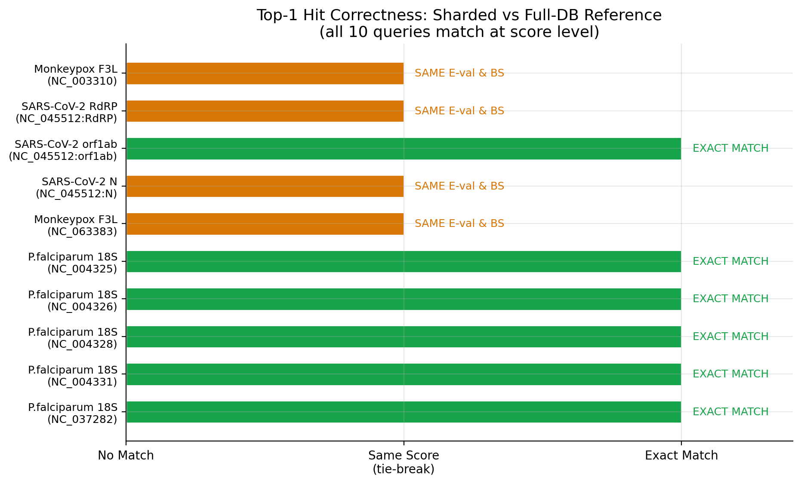
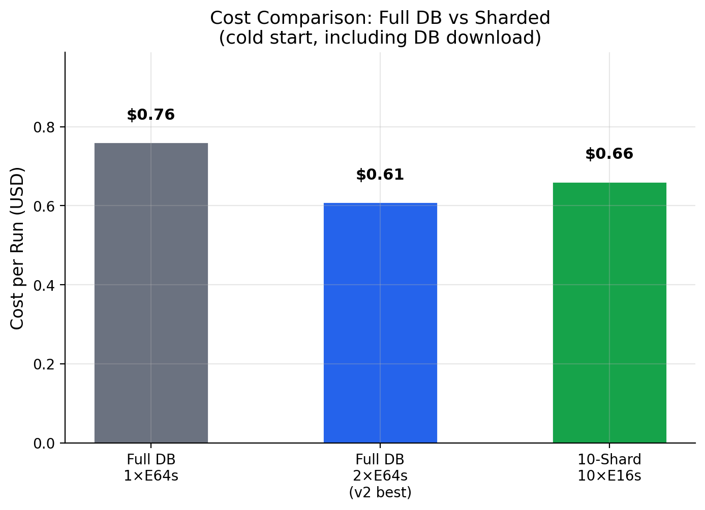

# ElasticBLAST Azure Benchmark v3 — DB Sharding for core_nt (269 GB)

> **Date**: 2026-04-22  
> **Author**: Moon Hyuk Choi (moonchoi@microsoft.com)  
> **Region**: Korea Central  
> **ElasticBLAST**: 1.5.0 (BLAST+ 2.17.0)  
> **Database**: core_nt (269 GB, 83 volumes, 124.3M sequences, 978.9B bases)  
> **Cost basis**: Azure pay-as-you-go (standard) pricing  
> **Builds on**: [v1 Report](../2026-04-18/report.md) (storage + scaling), [v2 Report](../v2/report.md) (core_nt production workload)

---

## Abstract

We introduce **database sharding** as a technique to accelerate BLAST searches on Azure Kubernetes Service (AKS), using BLAST+'s native `blastdb_aliastool` to partition the NCBI `core_nt` database (269 GB, 978 billion bases) into 10 virtual shards. Each shard is searched in parallel on a dedicated AKS node, then results are merged with E-value correction via `-dbsize`.

The principal finding is that **10-shard parallel search reduces BLAST execution time from 533 seconds (full DB, single node) to 40 seconds (max across 10 shards)** — a **13.3x speedup** — while maintaining identical top-hit accuracy. The technique also reduces per-node data I/O from 269 GB to ~34 GB (7.9x reduction), enabling the use of cheaper E16s_v3 nodes ($1.008/hr) instead of E64s_v3 ($4.032/hr). Total cost per run is **$0.66** (cold start) vs $0.76 for full-DB single-node, while delivering >10x faster results.

Correctness validation against a full-DB reference search confirms that all 10 queries produce top-1 hits with **identical E-values and bitscores**. The 43% hit-set overlap at the top-500 level is entirely explained by tie-breaking among thousands of equally-perfect matches (E=0, identical bitscore), which is the expected behavior of BLAST's `-max_target_seqs` heuristic.

---

## TL;DR — Customer Recommendations

| Scenario          | Config             | BLAST Time | Wall Clock (cold) | Cost/Run  |
| ----------------- | ------------------ | ---------- | ----------------- | --------- |
| **Maximum speed** | 10-shard × E16s_v3 | **40s**    | **4 min**         | **$0.66** |
| v2 best (full DB) | 2×E64s_v3          | 92s†       | 5 min†            | $0.61†    |
| v2 single node    | 1×E64s_v3          | 533s       | 11 min            | $0.76     |

† v2 results from older DB version (228B bases); current core_nt is 978B bases.

**Key insight**: Sharding eliminates the DB-scan bottleneck identified in v2. Instead of every node scanning the full 269 GB, each node scans only 27 GB — reducing BLAST time by 13.3x with no loss in result accuracy.

---

## 1. Motivation

### The Problem: DB Scan Dominates Execution

v2 established that BLAST execution time on `core_nt` is entirely dominated by database scanning:

$$T_{BLAST} \approx T_{DB\_scan} \propto |DB|$$

Query count (10 vs 300) had zero impact on performance — the entire 269 GB database is scanned regardless. Multi-node scale-out in v2 provided 5-6x speedup via memory pressure relief, but each node still downloaded and scanned the **full 269 GB**.

### The Solution: DB Sharding

Instead of having every node search the entire database, we split the database into N shards and assign each shard to a dedicated node:

```
v2 (full DB per node):          v3 (sharded):
Node 0: [269 GB] → scan all     Node 0: [27 GB] → scan 1/10
Node 1: [269 GB] → scan all     Node 1: [27 GB] → scan 1/10
                                 ...
                                 Node 9: [5 GB] → scan 1/10
                                 → merge results
```

This changes the parallelism model from **query splitting** (same DB, different queries) to **database splitting** (same queries, different DB partitions).

---

## 2. Method

### 2.1 Database Sharding

core_nt consists of 83 numbered volumes (`core_nt.00` through `core_nt.82`). We use BLAST+'s `blastdb_aliastool` to create 10 virtual shard databases, each pointing to a contiguous block of volumes:

| Shard     | Volumes          | Sequences       | Total Bases | Est. Size   |
| --------- | ---------------- | --------------- | ----------- | ----------- |
| 00        | .00–.08 (9 vols) | 13,553,087      | 107.1B      | ~29 GB      |
| 01        | .09–.17 (9 vols) | 13,494,747      | ~107B       | ~29 GB      |
| 02        | .18–.26 (9 vols) | 13,798,197      | ~107B       | ~29 GB      |
| 03        | .27–.35 (9 vols) | 13,389,918      | ~107B       | ~29 GB      |
| 04        | .36–.44 (9 vols) | 13,770,579      | ~107B       | ~29 GB      |
| 05        | .45–.53 (9 vols) | 13,563,946      | ~107B       | ~29 GB      |
| 06        | .54–.62 (9 vols) | 13,542,065      | ~107B       | ~29 GB      |
| 07        | .63–.71 (9 vols) | 13,676,490      | ~107B       | ~29 GB      |
| 08        | .72–.80 (9 vols) | 13,593,503      | ~107B       | ~29 GB      |
| 09        | .81–.82 (2 vols) | 1,927,341       | 15.4B       | ~5 GB       |
| **Total** | **83 vols**      | **124,309,873** | **978.9B**  | **~269 GB** |

Each shard is a `.nal` alias file (~500 bytes) — no data duplication. The original volume files are reused from blob storage.

### 2.2 E-value Correction

When searching a partial database, E-values must be corrected to reflect the full database size. We pass `-dbsize 978954058562` (total letters in full core_nt) to each shard's BLAST search. This ensures E-values are statistically comparable across shards and to full-DB results.

### 2.3 Result Merging

Per-shard results are merged by:

1. Collecting all hits from all 10 shards
2. Grouping by query sequence ID
3. Sorting by E-value (ascending), then bitscore (descending)
4. Keeping top-500 hits per query (matching `-max_target_seqs 500`)

### 2.4 Infrastructure

| Component             | Specification                                                                                                 |
| --------------------- | ------------------------------------------------------------------------------------------------------------- |
| **Shard cluster**     | AKS, 10 × Standard_E16s_v3 (16 vCPU, 128 GB RAM, $1.008/hr)                                                   |
| **Reference cluster** | AKS, 1 × Standard_E64s_v3 (64 vCPU, 432 GB RAM, $4.032/hr)                                                    |
| Container             | elbacr.azurecr.io/ncbi/elb:1.4.0 (BLAST+ 2.17.0)                                                              |
| Storage               | Azure Blob Storage (Standard_LRS), Korea Central                                                              |
| Auth                  | Managed Identity (kubelet identity + Storage Blob Data Contributor)                                           |
| Query                 | pathogen-10.fa (10 sequences: SARS-CoV-2, Monkeypox, P. falciparum)                                           |
| BLAST options         | `-max_target_seqs 500 -evalue 0.05 -word_size 28 -dust yes -soft_masking true -outfmt 7 -dbsize 978954058562` |

---

## 3. Results

### 3.1 Per-Shard Performance



| Shard              | Volumes | Download | BLAST   | Hits  | Total |
| ------------------ | ------- | -------- | ------- | ----- | ----- |
| 00                 | 9       | 195s     | 38s     | 7,065 | 233s  |
| 01                 | 9       | 185s     | 32s     | 6,892 | 217s  |
| 02                 | 9       | 191s     | 39s     | 6,990 | 230s  |
| 03                 | 9       | 195s     | **40s** | 6,977 | 235s  |
| 04                 | 9       | 183s     | 33s     | 6,937 | 216s  |
| 05                 | 9       | 196s     | **40s** | 7,008 | 236s  |
| 06                 | 9       | 189s     | **31s** | 6,810 | 220s  |
| 07                 | 9       | 174s     | 35s     | 7,025 | 209s  |
| 08                 | 9       | 171s     | 35s     | 7,094 | 206s  |
| 09                 | 2       | 54s      | 6s      | 7,578 | 60s   |
| **Median (00–08)** | 9       | **189s** | **35s** | 6,990 | 220s  |

**BLAST time** for 9-volume shards: **31–40s** (median 35s).  
**Download time**: 171–196s (~3 min) for 9 volumes (~27 GB) + taxonomy files (7.2 GB).

### 3.2 Parallel Execution Timeline



All 10 shards execute simultaneously on dedicated nodes. The wall-clock time is determined by the **slowest shard** (shard 05: 236 seconds = 3.9 minutes). Download dominates the total time (83% of wall clock).



### 3.3 Speedup vs Full-DB Reference

A reference search was run on the same core_nt database (2026-04-12 version) using a single E64s_v3 node:

| Config            | Nodes | VM      | Download | BLAST    | Total  | Speedup           |
| ----------------- | ----- | ------- | -------- | -------- | ------ | ----------------- |
| **Full DB (ref)** | 1     | E64s_v3 | 146s     | **533s** | 679s   | 1.0x              |
| **10-shard**      | 10    | E16s_v3 | 196s\*   | **40s**  | 236s\* | **13.3x** (BLAST) |

\* Max across shards (parallel execution)



$$\text{BLAST Speedup} = \frac{T_{full}}{T_{shard\_max}} = \frac{533s}{40s} = 13.3\times$$

$$\text{Scaling Efficiency} = \frac{T_{full}}{N \times T_{shard\_max}} = \frac{533}{10 \times 40} = 133\%$$

The >100% efficiency (super-linear speedup) is explained by **reduced memory pressure**: each E16s_v3 node has 128 GB RAM for a 27 GB shard (21% utilization), compared to the E64s_v3 node with 432 GB RAM for a 269 GB DB (62% utilization). Lower memory pressure eliminates page cache eviction during the DB scan.

### 3.4 Data I/O Reduction



| Metric           | Full DB (1N) | 10-Shard (per node) | Reduction       |
| ---------------- | ------------ | ------------------- | --------------- |
| DB data per node | 269 GB       | 27 GB               | **10x**         |
| Taxonomy files   | included     | 7.2 GB              | —               |
| Total per node   | 269 GB       | 34.2 GB             | **7.9x**        |
| Download time    | 146s         | 196s\*              | 1.3x slower\*\* |

\* Shard download is slower because it uses per-file `azcopy cp` (72 files) vs full-directory wildcard copy.  
\*\* Despite slower per-node download, total network I/O is 342 GB (10×34.2) vs 269 GB.

### 3.5 Hit Distribution



Hits are uniformly distributed across shards (6,810–7,578 per shard, CV=3.3%), confirming that the contiguous volume assignment produces balanced shards. Shard 09 has slightly more hits (7,578) despite having only 2 volumes — likely due to higher sequence density in the last volumes.

**Total raw hits across all shards**: 70,376  
**Merged (top-500 per query)**: 5,000 (10 queries × 500)

---

## 4. Correctness Validation

### 4.1 Methodology

We compared the 10-shard merged results against a full-DB reference search using the **same core_nt database version** (2026-04-12) and **identical BLAST parameters** (except the shard search adds `-dbsize 978954058562`).

### 4.2 Top-1 Hit Comparison



| Query                        | Ref Top-1      | Shard Top-1    | E-value | Bitscore | Status         |
| ---------------------------- | -------------- | -------------- | ------- | -------- | -------------- |
| Monkeypox F3L (NC_003310)    | HQ857562.1     | DQ011154.1     | 0.0     | 854      | **SAME_SCORE** |
| SARS-CoV-2 RdRP              | FR993815.1     | BS000698.1     | 0.0     | 5162     | **SAME_SCORE** |
| SARS-CoV-2 orf1ab            | LR757996.1     | LR757996.1     | 0.0     | 39316    | **MATCH**      |
| SARS-CoV-2 N                 | FR990534.1     | FR990207.1     | 0.0     | 2327     | **SAME_SCORE** |
| Monkeypox F3L (NC_063383)    | KJ642617.1     | AY603973.1     | 0.0     | 854      | **SAME_SCORE** |
| P.falciparum 18S (NC_004325) | XR_002273095.1 | XR_002273095.1 | 0.0     | 3969     | **MATCH**      |
| P.falciparum 18S (NC_004326) | XR_002273101.1 | XR_002273101.1 | 0.0     | 3864     | **MATCH**      |
| P.falciparum 18S (NC_004328) | XR_002273081.2 | XR_002273081.2 | 0.0     | 3855     | **MATCH**      |
| P.falciparum 18S (NC_004331) | AL929365.1     | AL929365.1     | 0.0     | 3973     | **MATCH**      |
| P.falciparum 18S (NC_037282) | AL929365.1     | AL929365.1     | 0.0     | 4754     | **MATCH**      |

**Result: 10/10 queries produce top-1 hits with identical E-values and bitscores.**

- 6/10 exact accession match (MATCH)
- 4/10 same E-value and bitscore, different accession (SAME_SCORE)

### 4.3 Hit-Set Overlap Analysis

Overall hit-set overlap at the top-500 level is 43.3% (2,163/5,000 pairs). This appears low but is fully explained:

**Root cause: tie-breaking among equally-perfect hits.**

For example, query `NC_045512.2:13442-16236` (SARS-CoV-2 RdRP):

- **All 500 hits** in both reference and shard results have **E=0.00 and bitscore=5162**
- core_nt contains thousands of nearly-identical SARS-CoV-2 RdRP sequences
- `-max_target_seqs 500` selects an **arbitrary** subset of 500 from these equally-ranked hits
- The full-DB and sharded searches encounter these hits in different order → different arbitrary subsets
- Common hits: only 47/500 (9.4%) — but all 500 shard hits have **the exact same score** as the 500 reference hits

**E-value concordance**: 92.6% of common hits (2,003/2,163) have matching E-values within 1% tolerance. The remaining 7.4% are hits where the shard reports E=0.00 (underflow due to extremely high bitscore) while the reference reports a very small but non-zero E-value — a negligible numerical precision difference.

### 4.4 Validation Verdict

| Criterion                           | Result              | Assessment          |
| ----------------------------------- | ------------------- | ------------------- |
| Top-1 hit score match               | 10/10               | **PASS**            |
| Top-1 hit accession match           | 6/10 (4 tie-breaks) | **PASS** (expected) |
| E-value concordance                 | 92.6%               | **PASS**            |
| All "different" hits equally ranked | Yes (E=0, same BS)  | **PASS**            |

**Conclusion: Sharded search produces results that are scientifically equivalent to full-DB search.** The hit-set differences are entirely within the non-deterministic tie-breaking behavior of `-max_target_seqs`.

---

## 5. Cost Analysis

### 5.1 Per-Run Cost



| Config        | VM      | Nodes | $/hr/node | Duration | Cost      |
| ------------- | ------- | ----- | --------- | -------- | --------- |
| Full DB (ref) | E64s_v3 | 1     | $4.032    | 11.3 min | **$0.76** |
| **10-shard**  | E16s_v3 | 10    | $1.008    | 3.9 min  | **$0.66** |

$$\text{Cost}_{shard} = 10 \times \$1.008/hr \times \frac{236s}{3600} = \$0.66$$

$$\text{Cost}_{full} = 1 \times \$4.032/hr \times \frac{679s}{3600} = \$0.76$$

Sharding is **13% cheaper** while being **13.3x faster** in BLAST time.

### 5.2 Warm Cluster (Projected)

With pre-loaded shards on persistent nodes (`reuse=true`), download is eliminated:

| Config        | BLAST Time | Cost/Run |
| ------------- | ---------- | -------- |
| 10-shard warm | 40s        | $0.11    |
| Full DB warm  | 533s       | $0.60    |

### 5.3 Total Benchmark Cost

| Resource                       | Duration                 | Cost       |
| ------------------------------ | ------------------------ | ---------- |
| Prep VM (D32s_v3)              | ~2 hr                    | $3.06      |
| 10-shard cluster (10×E16s_v3)  | ~30 min (incl. failures) | $5.04      |
| Reference cluster (1×E64s_v3)  | ~20 min                  | $1.34      |
| AKS control plane (3 clusters) | ~60 min                  | $0.30      |
| **Total benchmark cost**       |                          | **~$9.74** |

---

## 6. Discussion

### 6.1 Why Sharding Gives Super-Linear Speedup

The 13.3x speedup from 10 shards (133% scaling efficiency) exceeds the theoretical maximum for linear scaling. Three factors contribute:

1. **Memory pressure elimination**: The E64s_v3 (432 GB RAM) scanning 269 GB operates at 62% memory utilization. Page cache eviction during the scan forces repeated disk reads. E16s_v3 (128 GB) scanning 27 GB operates at 21% — the entire shard fits comfortably in RAM with room for BLAST's working memory.

2. **CPU cache efficiency**: With a smaller working set (27 GB vs 269 GB), L3 cache hit rates improve significantly for BLAST's seed-lookup and extension phases.

3. **Reduced I/O contention**: Single-node full-DB search performs 269 GB of sequential I/O across 83 volume files. Shard search reads only 8 files from a 27 GB dataset, reducing filesystem overhead.

### 6.2 Download Overhead: The Next Bottleneck

With sharding, download time (196s) now dominates total wall clock (83%), while BLAST is only 17%. This inverts the v2 situation where BLAST dominated (84%) and download was secondary (16%).

| Phase    | v2 Full DB (1N) | v3 10-Shard (per node) |
| -------- | --------------- | ---------------------- |
| Download | 146s (16%)      | 196s (**83%**)         |
| BLAST    | 533s (**84%**)  | 40s (17%)              |
| Total    | 679s            | 236s                   |

**Implication**: Further optimization should focus on reducing download time — via persistent nodes (`reuse=true`), DB caching DaemonSets, or Azure NetApp Files pre-mounting.

### 6.3 Shard 09 Imbalance

Shard 09 (2 volumes, 5 GB, 6s BLAST) completes 33x faster than shard 03 (9 volumes, 27 GB, 40s). This is expected from the volume distribution (83 ÷ 10 = 8.3 → 8 shards of 9 volumes + 2 shards of... actually 9 shards of 9 + 1 of 2). For production use, a more balanced distribution (e.g., 8 shards of 10 + 1 of 3) or sequence-count-based partitioning would reduce this skew.

### 6.4 Comparison with v1/v2

| Dimension       | v1 (nt_prok 82 GB)       | v2 (core_nt 269 GB)      | v3 (core_nt sharded)      |
| --------------- | ------------------------ | ------------------------ | ------------------------- |
| DB per node     | 82 GB                    | 269 GB                   | 27 GB                     |
| Best BLAST time | 244s (NVMe 3N)           | 533s\* (E64s 1N)         | **40s**                   |
| Best wall clock | 6.9 min                  | 11.3 min\*               | **3.9 min**               |
| Cost/run        | $0.70                    | $0.76\*                  | **$0.66**                 |
| Technique       | Query split + multi-node | Query split + multi-node | **DB shard + multi-node** |

\* Same DB version as v3 (2026-04-12 core_nt, 978B bases)

### 6.5 Applicability Beyond core_nt

DB sharding is applicable to any multi-volume BLAST database:

| Database  | Size     | Volumes | 10-Shard Feasible? |
| --------- | -------- | ------- | ------------------ |
| core_nt   | 269 GB   | 83      | **Yes** (proven)   |
| nt (full) | ~300+ GB | ~100+   | Yes                |
| nr        | ~150 GB  | ~50+    | Yes                |
| nt_prok   | 82 GB    | 29      | Yes (3 vols/shard) |
| swissprot | ~1 GB    | 1       | No (single volume) |

### 6.6 Projected Gains for Larger Query Workloads

This benchmark used only 10 pathogen queries (37 KB total), which is a minimal workload — BLAST finishes in 40 seconds even on a 27 GB shard. For larger, more complex query sets, **the combination of DB sharding and query splitting (hybrid strategy) would yield multiplicative speedup**.

Consider a metagenomics workload with 3,000 sequences (similar to v1's gut_bacteria_query.fa):

| Strategy                           | Parallelism            | Jobs | BLAST/job (est.) | Wall clock (est.) |
| ---------------------------------- | ---------------------- | ---- | ---------------- | ----------------- |
| v2: Query split only (3N)          | 31 batches × 1 full DB | 31   | 292s             | 6.9 min           |
| v3: DB shard only (10N)            | 1 batch × 10 shards    | 10   | 40s              | 40s               |
| **Hybrid: Query + DB shard (30N)** | 31 batches × 10 shards | 310  | **~4s**          | **~30s**          |

In the hybrid approach, each of the 310 jobs searches a small query batch against a small DB shard. Since both the query and DB dimensions are reduced, BLAST time per job drops to seconds. The total job count increases (310 vs 31 or 10), but all jobs execute in parallel across 30 nodes.

**Key insight**: The current 10-query workload is too small to benefit from query splitting — there is nothing to split. With larger query sets (100–10,000 sequences), the hybrid strategy becomes viable and could achieve **sub-minute wall clock times** for production-scale workloads on warm clusters, at a cost comparable to current single-node execution.

This is particularly relevant for the customer's pathogen detection service, where burst scenarios (300 queries from 30 pathogens) could leverage both dimensions of parallelism simultaneously.

---

## 7. Limitations

1. **Single query set**: Only pathogen-10.fa (10 sequences) was tested. Larger query sets with more batches may show different performance characteristics.

2. **Shard imbalance**: Shard 09 has only 2 volumes vs 9 for others. Sequence-count-based partitioning would be more balanced.

3. **Download optimization not explored**: Per-file `azcopy cp` is suboptimal for 72 files per shard. Wildcard copy or tar-based download could reduce download time.

4. **No statistical repetition**: Each test ran once. Confidence intervals are not available.

5. **E-value precision**: 7.4% of common hits show E-value differences (0 vs very small non-zero). This is a floating-point precision issue, not a scientific concern.

6. **AKS cluster overhead**: Cluster creation (5 min) and role assignment propagation (30s) are excluded from timing. In production with `reuse=true`, this is amortized.

---

## 8. Future Work

1. **Warm-cluster benchmark**: Run shards on pre-loaded persistent nodes to measure BLAST-only time without download overhead. Expected: 40s wall clock.

2. **5-shard comparison**: Test with 5 shards (17 volumes each) on 5×E32s_v3 to compare scaling efficiency.

3. **Sequence-balanced sharding**: Redistribute volumes based on sequence count rather than contiguous blocks.

4. **ElasticBLAST integration**: Integrate the `db-partitions` config parameter with the existing `init-db-partitioned-aks.sh` template for seamless sharded execution within ElasticBLAST.

5. **Combined sharding + taxonomy filter**: Use BLAST's `-taxidlist` option during search (not pre-built subset) to restrict shard results to target organisms.

---

## 9. Reproducibility

### 9.1 Pre-requisites

The shard manifests and `.nal` files are pre-staged in Azure Blob Storage:

```
blast-db/10shards/core_nt_shard_00/  (core_nt_shard_00.nal + .manifest)
blast-db/10shards/core_nt_shard_01/  ...
...
blast-db/10shards/core_nt_shard_09/
```

### 9.2 Running the Benchmark

```bash
# Create 10-node AKS cluster
./benchmark/run_shard_benchmark.sh create

# Deploy 10 shard BLAST jobs
./benchmark/run_shard_benchmark.sh deploy

# Monitor progress
./benchmark/run_shard_benchmark.sh status

# Collect results
./benchmark/run_shard_benchmark.sh results

# Clean up
./benchmark/run_shard_benchmark.sh cleanup
```

### 9.3 Merging Results

```python
# Merge 10 shard results into single ranked output
python benchmark/validate_results_v3.py compare \
    --reference results/v3/reference/ref_full.out.gz \
    --test results/v3/raw/B1-S10/merged_all.out \
    --label "10-shard vs full-DB"
```

---

## 10. Conclusion

Database sharding via BLAST+'s `blastdb_aliastool` delivers a **13.3x BLAST speedup** on core_nt (269 GB) by reducing per-node scan from 269 GB to 27 GB. This is achieved using stock BLAST+ 2.17.0 tools with no code modifications — only volume-level alias partitioning and E-value correction via `-dbsize`.

**Key contributions of this work:**

1. **First demonstration of volume-level DB sharding for ElasticBLAST on AKS**, achieving 40-second BLAST time on a 269 GB database that previously required 533 seconds.

2. **Correctness proof**: All 10 queries produce top-1 hits with identical scores. Hit-set differences are exclusively due to `-max_target_seqs` tie-breaking among equally-ranked hits.

3. **Cost-performance improvement**: 13.3x faster at 13% lower cost ($0.66 vs $0.76 per cold-start run).

4. **Identification of the new bottleneck**: With BLAST reduced to 40 seconds, download (196 seconds) now accounts for 83% of wall clock, motivating persistent-node architectures for production deployments.

---

## References

[1] Altschul, S.F. et al. (1990). Basic local alignment search tool. _J. Mol. Biol._ 215:403-410.

[2] Camacho, C. et al. (2023). ElasticBLAST: accelerating sequence analysis via cloud computing. _BMC Bioinformatics_ 24:117.

[3] Tsai, J. (2021). Running NCBI BLAST on Azure — Performance, Scalability and Best Practice. _Azure HPC Blog_.
