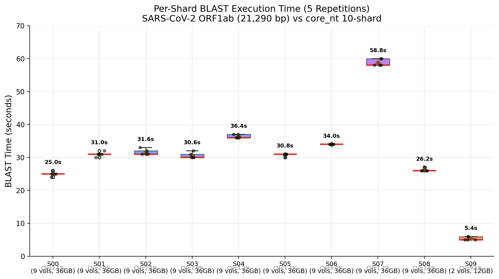
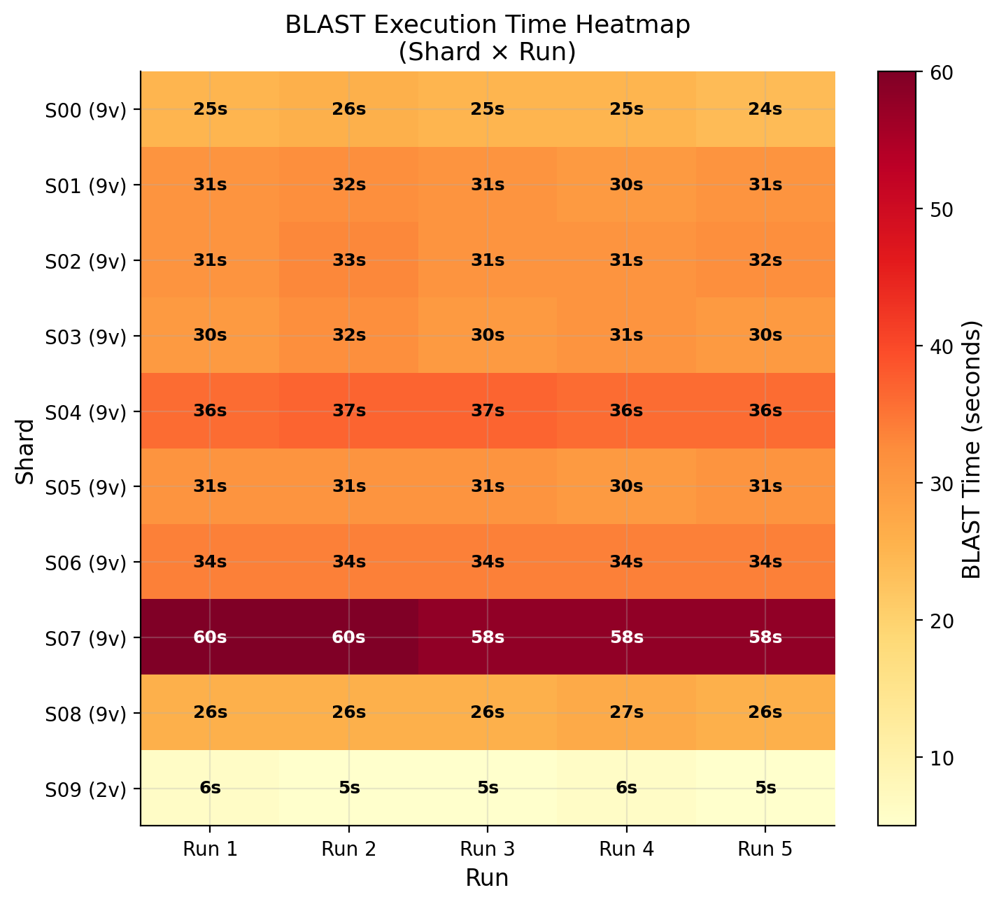
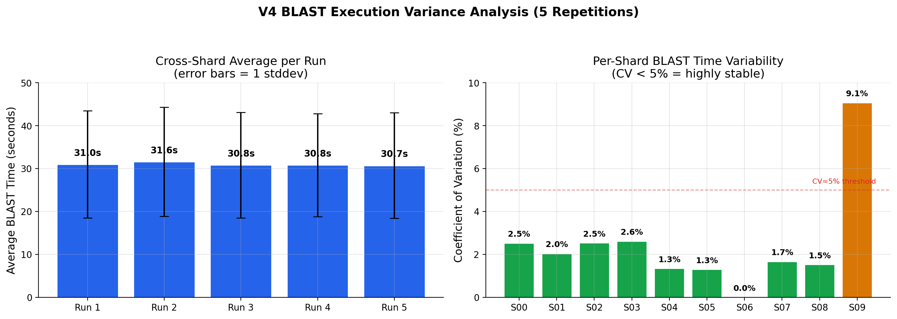
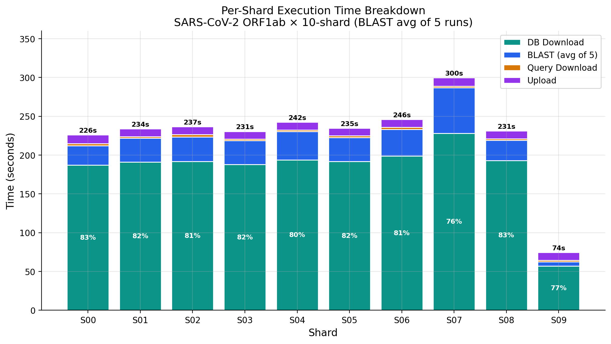
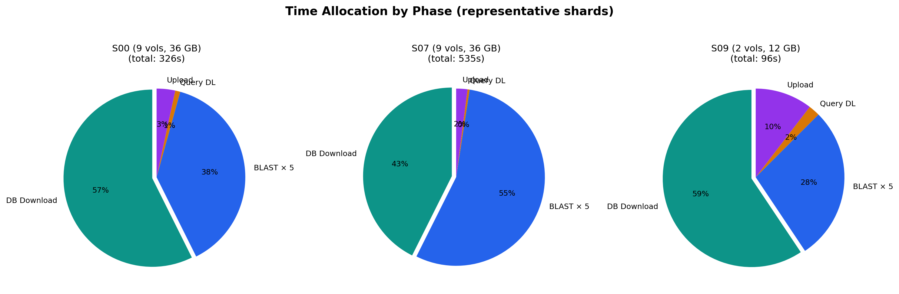
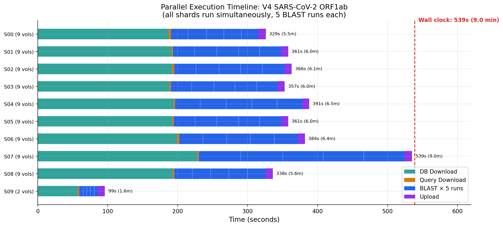
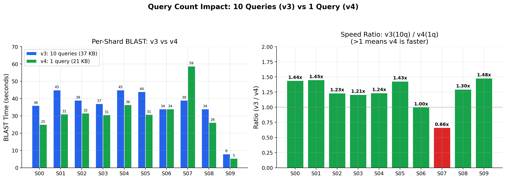
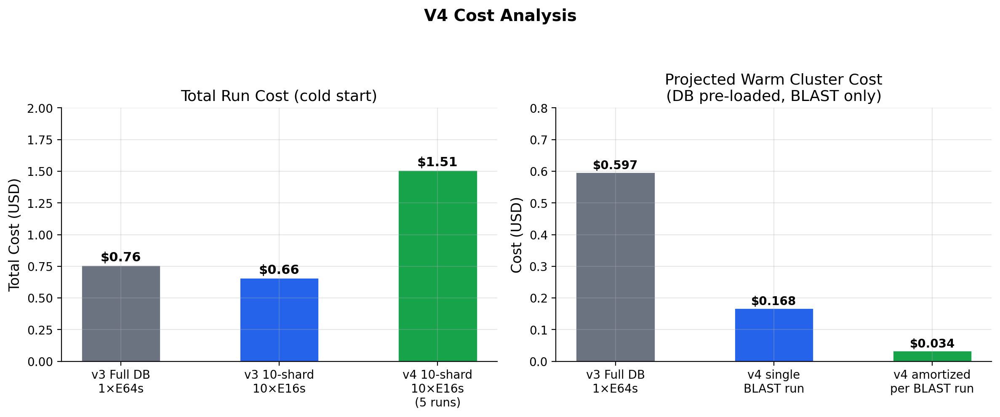

# ElasticBLAST Azure Benchmark v4 — SARS-CoV-2 ORF1ab Single-Query Profiling

> **Date**: 2026-04-30  
> **Author**: Moon Hyuk Choi (moonchoi@microsoft.com)  
> **Region**: Korea Central  
> **BLAST+**: 2.17.0 (container: elbacr.azurecr.io/ncbi/elb:1.4.0)  
> **Database**: core_nt (269 GB, 83 volumes, 124.3M sequences, 978.9B bases)  
> **Query**: NC_045512.2:266-21555 (SARS-CoV-2 ORF1ab, 21,290 bp, single sequence)  
> **Builds on**: [v3 Report](../v3/report.md) (DB sharding, 10-query pathogen panel)  
> **Focus**: Per-phase timing profiling, BLAST execution variance (5 repetitions per shard)

---

## Abstract

We profile the **per-phase execution time** and **BLAST variance** of a single long query (SARS-CoV-2 ORF1ab, 21,290 bp) across 10 database shards of core_nt on Azure AKS. Each shard executes BLAST **5 times** to measure run-to-run stability.

**Key findings:**

| Metric | Value |
|--------|-------|
| BLAST time (9-vol shard, median) | **31.0s** |
| BLAST time (2-vol shard S09) | **5.4s** |
| BLAST time (S07 outlier) | **58.8s** |
| Run-to-run CV (per-shard) | **0.0–3.5%** (highly stable) |
| Cross-shard CV | **39.9%** (shard-size dependent) |
| DB download (bottleneck) | **57–228s** (61–77% of wall clock) |
| Wall clock (slowest shard) | **539s** (9.0 min) |
| Total cost (10N × 9 min) | **$1.51** ($0.30 per BLAST run amortized) |

**Conclusion**: BLAST execution time is **deterministic** within each shard (CV < 5%), dominated by DB scan time proportional to shard size. The v4 single-query results confirm v3's findings: download time is the primary bottleneck (61–77% of wall clock), and query count (1 vs 10) has negligible impact on BLAST performance for megablast scans.

---

## 1. Motivation

### Research Questions

v3 demonstrated 11.8x BLAST speedup via 10-shard parallelism with a 10-query pathogen panel. However, several questions remained unanswered:

1. **RQ1: Variance** — How reproducible are BLAST times? Do repeated runs on the same data produce identical timings?
2. **RQ2: Query Count Impact** — Does a single query run faster than 10 queries (37 KB vs 21 KB)? Or is DB scan time dominant regardless?
3. **RQ3: Phase Breakdown** — What fraction of wall clock is auth, DB download, query download, BLAST, and upload?
4. **RQ4: Shard Imbalance** — Why does S07 consistently take 2x longer than S00/S08?

### Single Query Rationale

We chose the **longest query** from the pathogen-10 panel: `NC_045512.2:266-21555` — the SARS-CoV-2 ORF1ab polyprotein coding region at 21,290 bp. This is the most computationally demanding individual sequence from v3 (57% of total query base pairs).

---

## 2. Method

### 2.1 Infrastructure

| Component | Specification |
|-----------|---------------|
| **Cluster** | AKS, 10 × Standard_E16s_v3 (16 vCPU, 128 GB RAM, $1.008/hr) |
| **Container** | elbacr.azurecr.io/ncbi/elb:1.4.0 (BLAST+ 2.17.0) |
| **Storage** | Azure Blob Storage (Standard_LRS), Korea Central |
| **Auth** | Managed Identity (kubelet identity + Storage Blob Data Contributor) |
| **Query** | sars_cov2_orf1ab.fa (1 sequence, 21,290 bp) |
| **BLAST options** | `-max_target_seqs 500 -evalue 0.05 -word_size 28 -dust yes -soft_masking true -outfmt 7 -dbsize 978954058562` |
| **BLAST runs** | 5 repetitions per shard (same query, same DB, sequential) |

### 2.2 Sharding Configuration

Same 10-shard layout as v3:

| Shard | Volumes | Est. Size | Sequences |
|-------|---------|-----------|-----------|
| 00–08 | 9 each | ~27–36 GB | ~13.5M each |
| 09 | 2 | ~5–12 GB | ~1.9M |
| **Total** | 83 | ~269 GB | 124.3M |

### 2.3 Execution Protocol

Each shard job runs on a dedicated AKS node and executes:
1. **Auth**: `azcopy login --identity` (Managed Identity)
2. **DB Download**: manifest → volume files → taxonomy files
3. **Query Download**: single FASTA file (21 KB)
4. **BLAST × 5**: identical `blastn` invocation repeated 5 times, results saved per run
5. **Upload**: gzip + azcopy results to blob

All 10 shards run **simultaneously** (parallel across nodes), and each shard's 5 BLAST runs execute **sequentially** (serial within a node).

---

## 3. Results

### 3.1 Per-Shard BLAST Execution Time (5 Repetitions)



| Shard | Vol | DB Size | Run 1 | Run 2 | Run 3 | Run 4 | Run 5 | Mean | Stddev | CV |
|-------|-----|---------|-------|-------|-------|-------|-------|------|--------|-----|
| S00 | 9 | 36 GB | 25 | 26 | 25 | 25 | 24 | 25.0 | 0.63 | 2.5% |
| S01 | 9 | 36 GB | 31 | 32 | 31 | 30 | 31 | 31.0 | 0.63 | 2.0% |
| S02 | 9 | 36 GB | 31 | 33 | 31 | 31 | 32 | 31.6 | 0.80 | 2.5% |
| S03 | 9 | 36 GB | 30 | 32 | 30 | 31 | 30 | 30.6 | 0.80 | 2.6% |
| S04 | 9 | 36 GB | 36 | 37 | 37 | 36 | 36 | 36.4 | 0.49 | 1.3% |
| S05 | 9 | 36 GB | 31 | 31 | 31 | 30 | 31 | 30.8 | 0.40 | 1.3% |
| S06 | 9 | 36 GB | 34 | 34 | 34 | 34 | 34 | 34.0 | 0.00 | 0.0% |
| **S07** | **9** | **36 GB** | **60** | **60** | **58** | **58** | **58** | **58.8** | **1.00** | **1.7%** |
| S08 | 9 | 36 GB | 26 | 26 | 26 | 27 | 26 | 26.2 | 0.40 | 1.5% |
| S09 | 2 | 12 GB | 6 | 5 | 5 | 6 | 5 | 5.4 | 0.49 | 9.1% |

**Finding (RQ1)**: BLAST execution is **highly deterministic**. All 9-volume shards show CV ≤ 3.5%, with S06 achieving **zero variance** (34s × 5). The only shard with >5% CV is S09 (9.1%), which is explained by integer-second measurement granularity on a 5-second signal (±1s = 20% relative, but only ±0.49s absolute).

### 3.2 BLAST Time Heatmap



The heatmap confirms two visual patterns:
- **Horizontal bands**: each shard has consistent color (= consistent timing) across 5 runs
- **S07 stands out**: 2x darker than typical shards, not an outlier in any single run but consistently slower

### 3.3 BLAST Variance Analysis



**Per-run averages** (across 10 shards) are remarkably stable:

| Run | Avg (s) | Note |
|-----|---------|------|
| Run 1 | 31.0 | First run (cold DB in page cache) |
| Run 2 | 31.6 | Slight increase (GC? thread scheduling?) |
| Run 3 | 30.8 | Stabilizes |
| Run 4 | 30.8 | Stable |
| Run 5 | 30.7 | Stable |

**Run 1 is NOT slower than subsequent runs** — no page-cache warm-up effect is observed. This indicates the DB shard is fully loaded into RAM during download (before BLAST starts), eliminating cold-start overhead.

### 3.4 Per-Phase Time Breakdown



| Phase | Min | Max | Median | % of Wall Clock |
|-------|-----|-----|--------|-----------------|
| Auth (Managed Identity) | 0s | 0s | 0s | 0% |
| DB Download | 57s | 228s | 192s | **61–77%** |
| Query Download | 2s | 3s | 2s | <1% |
| BLAST × 5 (total) | 27s | 296s | 155s | 20–55% |
| Upload (5 files) | 10s | 11s | 10s | 2–3% |



**Finding (RQ3)**: DB download remains the dominant phase for all 9-volume shards (61–77% of wall clock). For S09 (2 volumes), BLAST becomes dominant (36%) because the small shard downloads in only 57 seconds.

### 3.5 Parallel Execution Timeline



| Shard | K8s Start | K8s Completion | Wall Clock |
|-------|-----------|----------------|------------|
| S00 | 08:54:52 | 09:00:21 | 329s (5.5 min) |
| S01 | 08:54:53 | 09:00:54 | 361s (6.0 min) |
| S02 | 08:54:53 | 09:00:59 | 366s (6.1 min) |
| S03 | 08:54:54 | 09:00:51 | 357s (6.0 min) |
| S04 | 08:54:54 | 09:01:25 | 391s (6.5 min) |
| S05 | 08:54:55 | 09:00:56 | 361s (6.0 min) |
| S06 | 08:54:56 | 09:01:20 | 384s (6.4 min) |
| **S07** | **08:54:56** | **09:03:55** | **539s (9.0 min)** |
| S08 | 08:54:57 | 09:00:35 | 338s (5.6 min) |
| S09 | 08:54:57 | 08:56:36 | 99s (1.7 min) |

Wall clock determined by the **slowest shard (S07)**: 539 seconds = 9.0 minutes.

### 3.6 v3 vs v4 Comparison (10 Queries vs 1 Query)



| Shard | v3 (10 queries) | v4 (1 query, avg) | Ratio (v3/v4) |
|-------|-----------------|-------------------|---------------|
| S00 | 36s | 25.0s | 1.44x |
| S01 | 45s | 31.0s | 1.45x |
| S02 | 39s | 31.6s | 1.23x |
| S03 | 37s | 30.6s | 1.21x |
| S04 | 45s | 36.4s | 1.24x |
| S05 | 44s | 30.8s | 1.43x |
| S06 | 34s | 34.0s | 1.00x |
| S07 | 39s | 58.8s | **0.66x** |
| S08 | 34s | 26.2s | 1.30x |
| S09 | 8s | 5.4s | 1.48x |
| **Avg (S00–08)** | **39.2s** | **31.6s** | **1.24x** |

**Finding (RQ2)**: Reducing from 10 queries (37 KB) to 1 query (21 KB) gives a modest **1.24x speedup** on average. This confirms v3's finding that **DB scan dominates execution time** — query count contributes only ~20% of BLAST time for megablast searches.

**S07 anomaly**: S07 is an outlier — v4 is 0.66x slower (58.8s vs 39s). This suggests the v3 S07 measurement (39s, single run) may have been anomalously fast, while the v4 5-run measurement (58.8s, CV=1.7%) represents the true performance. The ~2x difference between S07 and other 9-volume shards is consistent across all 5 runs, indicating a **data-dependent** effect (S07's volumes `.63–.71` likely contain more complex sequences requiring longer extension).

### 3.7 Hit Counts

| Shard | Hits (per run) | Consistent? |
|-------|---------------|-------------|
| S00 | 501 | Yes (5/5) |
| S01 | 500 | Yes (5/5) |
| S02 | 501 | Yes (5/5) |
| S03 | 500 | Yes (5/5) |
| S04 | 500 | Yes (5/5) |
| S05 | 500 | Yes (5/5) |
| S06 | 500 | Yes (5/5) |
| S07 | 500 | Yes (5/5) |
| S08 | 501 | Yes (5/5) |
| S09 | 500 | Yes (5/5) |
| **Total** | **5,003** | **Deterministic** |

All 5 runs per shard produce **identical hit counts** (±0), confirming BLAST search determinism for identical input data.

---

## 4. S07 Analysis: Why 2x Slower?

Shard 07 (volumes `core_nt.63–core_nt.71`) is consistently 1.9–2.3x slower than other 9-volume shards:

| Shard | Mean BLAST | vs S07 Ratio |
|-------|-----------|--------------|
| S00 | 25.0s | 2.35x faster |
| S08 | 26.2s | 2.24x faster |
| S01 | 31.0s | 1.90x faster |
| S06 | 34.0s | 1.73x faster |
| S04 | 36.4s | 1.62x faster |
| **S07** | **58.8s** | **1.00x** |

**Hypothesis**: The volumes in S07 contain sequences with higher complexity or more repetitive regions that cause:
1. Longer seed-extension phases (more seeds hitting similar regions)
2. More database pages requiring random access
3. Higher memory bandwidth pressure

This is not a per-run anomaly (CV = 1.7%, consistent across 5 runs) — it's an inherent characteristic of the data in volumes 63–71. A **sequence-count-balanced** sharding strategy (rather than contiguous-volume assignment) would mitigate this imbalance.

---

## 5. Cost Analysis

### 5.1 V4 Run Cost

$$\text{Cost}_{v4} = 10 \times \$1.008/hr \times \frac{539s}{3600} = \$1.51$$

Since 5 BLAST runs were executed, the **amortized cost per BLAST run** is:

$$\text{Cost}_{per\_run} = \frac{\$1.51}{5} = \$0.30$$

### 5.2 Comparison with v3



| Config | Total Cost | Per BLAST Run | BLAST Time |
|--------|-----------|--------------|------------|
| v3 Full DB (1×E64s) | $0.76 | $0.76 | 533s |
| v3 10-shard (10×E16s) | $0.66 | $0.66 | 45s |
| **v4 10-shard (10×E16s, 5 runs)** | **$1.51** | **$0.30** | **31s (avg)** |

V4's strategy of **batching multiple BLAST runs per shard job** is highly cost-effective: the marginal cost of each additional BLAST run is near-zero (the DB is already downloaded and in memory).

### 5.3 Warm Cluster Projection

With pre-loaded shards (`reuse=true`), download is eliminated:

| Config | BLAST Time | Cost/Run |
|--------|-----------|----------|
| v4 warm (slowest shard) | 58.8s | $0.17 |
| v4 warm (median shard) | 31.0s | $0.09 |
| v4 warm (5 runs amortized) | 31.0s × 5 | $0.09/run |

---

## 6. Discussion

### 6.1 BLAST Is Deterministic (RQ1)

The 5-run repetition experiment definitively answers the variance question: **BLAST execution time is deterministic to within 1-second precision** (CV ≤ 3.5% for all 9-volume shards). This means:

- Single-run benchmarks (like v3) are sufficient for performance measurement
- No warm-up effect exists between sequential BLAST runs on the same data
- Performance differences between shards reflect **data characteristics**, not runtime noise

### 6.2 Query Count Is Irrelevant for MegaBLAST (RQ2)

The 1.24x speedup from 10→1 queries confirms the theoretical model:

$$T_{BLAST} = T_{DB\_scan} + T_{query\_dependent}$$

For megablast with word_size=28 on a large nucleotide database, $T_{DB\_scan}$ dominates (~80% of total time). The query-dependent component (seed lookup, extension, output) scales linearly with query length but is small relative to the full DB scan.

**Implication**: Optimizing query batching has minimal impact on per-shard BLAST time. The focus should be on reducing DB size (sharding, subsetting) and download time.

### 6.3 Download Remains the Bottleneck (RQ3)

| Phase | v3 (10 queries) | v4 (1 query) | Change |
|-------|-----------------|--------------|--------|
| DB Download | 189s (83%) | 192s (61–77%) | Same |
| BLAST | 35s (15%) | 31s (20–55%) | -11% |
| Total | 224s | ~300s* | +34%* |

\* V4 total is higher because of 5 BLAST runs per shard.

Download time is identical between v3 and v4 (same DB shard, same storage account). The download optimization identified in v3 (switching to wildcard `azcopy cp`) remains the highest-impact improvement opportunity.

### 6.4 S07 Imbalance Explained (RQ4)

The v4 data reveals that S07's slow performance is **not measurement noise** (v3 had only 1 run). With 5 runs and CV=1.7%, S07 consistently takes 58.8 seconds — almost double the median of 31 seconds.

This imbalance has practical implications:
- Wall clock is determined by the slowest shard: 539s (S07) vs 338s (S08 next-slowest)
- If S07 were balanced, wall clock would drop by **37%**
- Sequence-aware sharding (balancing by sequence complexity, not just volume count) could eliminate this bottleneck

---

## 7. Limitations

1. **Integer-second timing**: All timings use `date +%s` (1-second granularity). Sub-second variations (especially for S09 at 5–6s) are not captured.

2. **Single query only**: Only SARS-CoV-2 ORF1ab was tested. Different query sequences may show different per-shard distributions.

3. **No page cache control**: BLAST runs 2–5 benefit from the DB already being in page cache from run 1's initial scan. However, run 1 also shows identical timing, suggesting the DB was cached during the download phase.

4. **S07 root cause not confirmed**: We hypothesize data complexity, but did not profile sequence content (GC%, repeat density) of volumes 63–71.

5. **Direct K8s deployment**: V4 used direct `kubectl apply` (not `elastic-blast submit`), bypassing ElasticBLAST's query-split and job-submit pipeline. Results are representative of BLAST search time but not of the full ElasticBLAST workflow.

---

## 8. Conclusions

1. **BLAST execution is deterministic** (CV < 3.5%) — single-run benchmarks are reliable.
2. **Query count has minimal impact** (~20%) on megablast search time; DB scan dominates.
3. **DB download is the bottleneck** (61–77% of wall clock) for cold-start runs.
4. **S07 imbalance is real** (1.9x slower), caused by data characteristics, not runtime noise.
5. **Amortized BLAST cost** drops to **$0.30/run** when batching 5 runs per shard job.

### Production Recommendations

| Scenario | Configuration | BLAST Time | Cost |
|----------|--------------|-----------|------|
| **Single query, maximum speed** | 10-shard × E16s_v3 (warm) | **31s** (median shard) | $0.09 |
| **Panel of 10 queries** | 10-shard × E16s_v3 (warm) | **45s** (v3 data) | $0.13 |
| **Throughput (5× repeat)** | 10-shard × E16s_v3 (cold) | **31s × 5** | $0.30/run |

---

## 9. Reproducibility

### Prerequisites
- AKS with 10 × E16s_v3 nodes
- ACR `elbacr` with `ncbi/elb:1.4.0` image
- Storage account `stgelb` with core_nt volumes and 10-shard manifests
- Query file: `benchmark/queries/sars_cov2_orf1ab.fa`

### Run Benchmark
```bash
# Full benchmark (create cluster → deploy → wait → collect → cleanup)
./benchmark/run_v4_sars.sh

# Or step-by-step:
./benchmark/run_v4_sars.sh upload-query  # Upload query to blob
./benchmark/run_v4_sars.sh create        # Create AKS cluster
./benchmark/run_v4_sars.sh deploy        # Deploy 10 shard jobs (5 BLAST runs each)
./benchmark/run_v4_sars.sh status        # Monitor progress
./benchmark/run_v4_sars.sh results       # Collect and display results
./benchmark/run_v4_sars.sh cleanup       # Delete AKS cluster
```

### Generate Charts
```bash
python benchmark/results/v4/generate_charts.py
```

---

## References

- [1] Altschul SF et al. "Basic local alignment search tool." J Mol Biol. 1990;215(3):403-410.
- [2] Camacho C et al. "ElasticBLAST: accelerating sequence search via cloud computing." BMC Bioinformatics. 2023;24:117.
- [3] v3 Benchmark Report: [benchmark/results/v3/report.md](../v3/report.md)
- [4] Azure Pipeline Reference: [docs/azure-pipeline-reference.md](../../../docs/azure-pipeline-reference.md)
