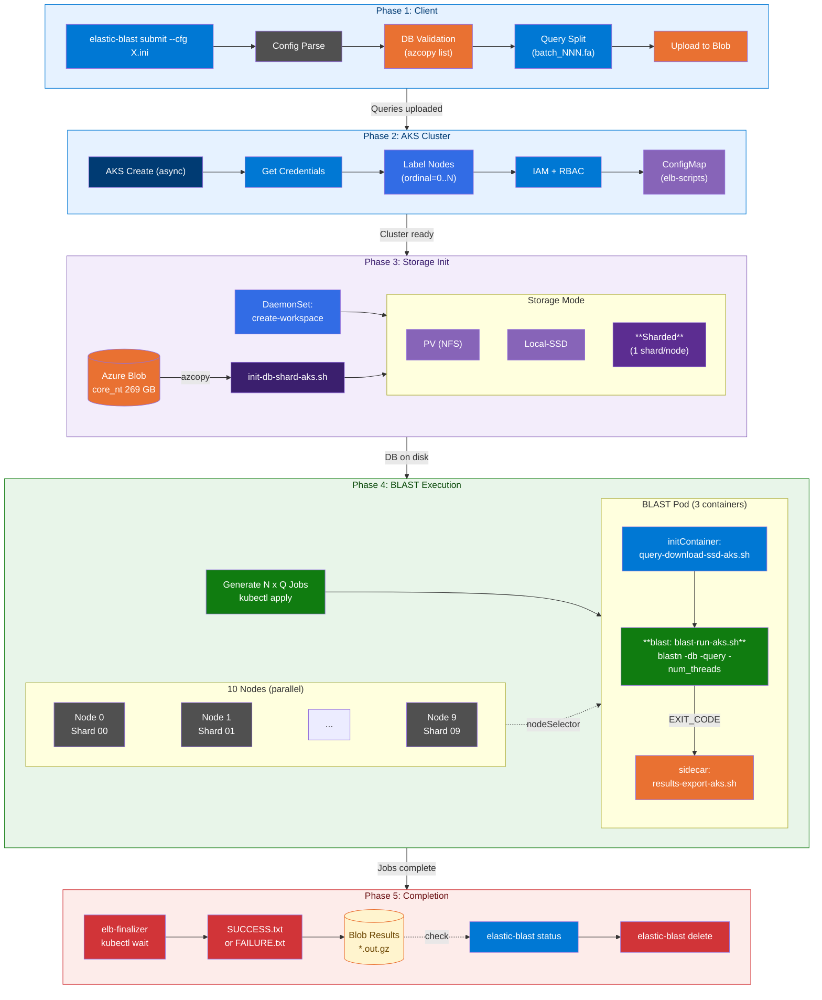

# ElasticBLAST Azure Pipeline Reference

Comprehensive technical reference for every stage of the ElasticBLAST Azure data pipeline.
Each section explains **what** happens, **why** it's needed, **which code** runs, and **how to verify** each stage.

---

## Pipeline Overview



The pipeline consists of 6 phases:

| Phase                  | What                                                        | Why                                                               | Duration  |
| ---------------------- | ----------------------------------------------------------- | ----------------------------------------------------------------- | --------- |
| **1. Client**          | Parse config, validate DB, split queries, upload to Blob    | Ensure inputs are valid before creating expensive cloud resources | ~30s      |
| **2. AKS Cluster**     | Create AKS cluster, label nodes, assign IAM roles           | Provide compute infrastructure for BLAST jobs                     | 5-15 min  |
| **3. Storage Init**    | Download BLAST DB to each node's local SSD                  | BLAST requires DB files locally — cannot query Blob directly      | 1-5 min   |
| **4. BLAST Execution** | Run BLAST on each query batch (×each shard), export results | The actual sequence search — the core workload                    | 30s-60min |
| **5. Completion**      | Finalizer writes SUCCESS/FAILURE marker, results on Blob    | Signal completion and upload all artifacts for retrieval          | ~1 min    |
| **6. Cleanup**         | Delete AKS cluster and leaked resources                     | Stop billing — AKS charges by the minute                          | ~3 min    |

**Reuse Mode** (`reuse = true`): Skips Phase 2 on subsequent submits — the AKS cluster stays alive between runs, and if the DB is already on local SSDs, Phase 3 is also skipped. This reduces cold-start from ~25 min to ~45s.

---

## Table of Contents

1. [DB Source Resolution](#1-db-source-resolution) — Where does the BLAST database come from?
2. [Query Splitting](#2-query-splitting) — How are queries divided for parallel execution?
3. [AKS Cluster Creation](#3-aks-cluster-creation) — How is compute infrastructure provisioned?
4. [Node Labeling](#4-node-labeling) — How are nodes assigned to specific DB shards?
5. [Storage Initialization](#5-storage-initialization) — How does the DB get from Blob to local disk?
6. [Job Template Upload](#6-job-template-upload) — How are BLAST job specifications prepared?
7. [BLAST Job Generation](#7-blast-job-generation) — How are parallel BLAST jobs created and submitted?
8. [Pod Scripts](#8-pod-scripts) — What runs inside each container?
9. [K8s Templates](#9-k8s-templates) — What Kubernetes resources are created?
10. [Results and Logs](#10-results-and-logs) — Where do results go and what files are produced?
11. [Status Checking](#11-status-checking) — How does ElasticBLAST determine if a search is complete?
12. [Cleanup](#12-cleanup) — How are cloud resources deleted to stop billing?
13. [Reuse Mode](#13-reuse-mode) — How does warm-cluster reuse work?

---

## 1. DB Source Resolution

ElasticBLAST supports databases from multiple sources (NCBI, Azure Blob, GCS, S3). Before spending 15 minutes creating an AKS cluster, ElasticBLAST verifies the DB actually exists and is accessible — a typo in the DB URL would waste time and money.

The DB URL from the INI config is parsed to determine the source type. For Azure custom DBs (`https://` prefix), ElasticBLAST runs `azcopy list` to verify the files exist. For NCBI standard DBs (no prefix), it will later use `update_blastdb.pl` to download from NCBI servers.

ElasticBLAST supports fetching NCBI standard DBs from GCS (`gs://`) or S3 (`s3://`) mirrors in addition to the NCBI FTP servers. Cloud-hosted mirrors are co-located with compute nodes in the same cloud region, so downloads are significantly faster — typically **5-10 Gbps** (intra-cloud) vs **100-300 Mbps** (NCBI FTP over the internet). For a 269 GB database like `core_nt`, this translates to roughly **4-7 minutes** from cloud storage vs **2+ hours** from NCBI FTP. On Azure, users pre-stage the DB in their own Blob Storage account for the same intra-datacenter speed advantage.

### Source Files

- [src/elastic_blast/elb_config.py](../src/elastic_blast/elb_config.py) — config parsing
- [src/elastic_blast/util.py](../src/elastic_blast/util.py#L316) — `get_blastdb_info()`
- [src/elastic_blast/constants.py](../src/elastic_blast/constants.py#L124) — URL prefix constants

### URL Prefix Constants (`constants.py`)

| Constant           | Value      | CSP          |
| ------------------ | ---------- | ------------ |
| `ELB_S3_PREFIX`    | `s3://`    | AWS          |
| `ELB_GCS_PREFIX`   | `gs://`    | GCP          |
| `ELB_AZURE_PREFIX` | `https://` | Azure        |
| `ELB_HTTP_PREFIX`  | `http`     | Generic HTTP |
| `ELB_FTP_PREFIX`   | `ftp://`   | FTP          |

### Resolution Logic (`get_blastdb_info()` in `util.py:316`)

**Function signature:**

```python
def get_blastdb_info(blastdb: str, gcp_prj: str | None = None, sas_token: Optional[str] = None)
```

**Returns:** `(db_name: str, db_path: str, k8s_label: str)`

**Decision tree:**

1. **GCS custom DB** (`gs://` prefix): Runs `gsutil ls {db}.*`, checks for `.tar.gz`, returns `(basename, full_path, sanitized_label)`
2. **Azure custom DB** (`https://` prefix): Runs `azcopy list` against the parent directory, filters files matching the DB name. If SAS token available, appends to URL. Returns `(basename, blob_dir/*, sanitized_label)`
3. **NCBI standard DB** (no prefix): Returns `(db_name, '', sanitized_label)` — downloaded via `update_blastdb.pl`

**Azure-specific validation** (`check_user_provided_blastdb_exists()` in `util.py:376`):

- Runs `azcopy list {parent_dir}` and filters output for the DB basename
- Raises `ValueError` if no matching files found

### Config Keys

| INI Key                       | Python Attribute                | Description                              |
| ----------------------------- | ------------------------------- | ---------------------------------------- |
| `[blast] db`                  | `cfg.blast.db`                  | BLAST database name or URL               |
| `[blast] db-source`           | `cfg.cluster.db_source`         | DB source: `GCP`, `AWS`, `AZURE`, `NCBI` |
| `[blast] db-partitions`       | `cfg.blast.db_partitions`       | Number of DB shards (0 = unpartitioned)  |
| `[blast] db-partition-prefix` | `cfg.blast.db_partition_prefix` | Blob URL prefix for shard directories    |

---

## 2. Query Splitting

BLAST processes one query file at a time. To parallelize across multiple pods, the input query file must be split into smaller batches, where each batch becomes an independent BLAST job that can run on a different node.

The input FASTA file is read and split into batches of `batch_len` bases each. If the file is small enough (<20 MB uncompressed), splitting happens on the client machine. For larger files on cloud storage, a two-stage cloud split is used. Split batches are uploaded to `{results}/{job_id}/query_batches/batch_NNN.fa` on Azure Blob Storage.

### Source Files

- [src/elastic_blast/commands/submit.py](../src/elastic_blast/commands/submit.py#L59) — `get_query_split_mode()`, `split_query()`
- [src/elastic_blast/split.py](../src/elastic_blast/split.py) — `FASTAReader`

### Split Mode Selection (`get_query_split_mode()` in `submit.py:59`)

| Mode              | Enum                             | Condition                                                                                        |
| ----------------- | -------------------------------- | ------------------------------------------------------------------------------------------------ |
| `CLIENT`          | `QuerySplitMode.CLIENT`          | Env var `ELB_USE_CLIENT_SPLIT` set, OR multiple query files, OR single file below size threshold |
| `CLOUD_ONE_STAGE` | `QuerySplitMode.CLOUD_ONE_STAGE` | AWS only + env var `ELB_USE_1_STAGE_CLOUD_SPLIT`                                                 |
| `CLOUD_TWO_STAGE` | `QuerySplitMode.CLOUD_TWO_STAGE` | Single file on cloud storage exceeding `min_fsize_to_split_on_client`                            |

**Size thresholds (configurable):**

- Compressed: `ELB_DFLT_MIN_QUERY_FILESIZE_TO_SPLIT_ON_CLIENT_COMPRESSED` = **5 MB**
- Uncompressed: `ELB_DFLT_MIN_QUERY_FILESIZE_TO_SPLIT_ON_CLIENT_UNCOMPRESSED` = **20 MB**

### Client-Side Split (`split_query()` in `submit.py:259`)

```python
def split_query(query_files: list[str], cfg: ElasticBlastConfig) -> tuple[list[str], int]:
```

1. Opens all query files via `open_for_read_iter()` (supports Azure Blob, GCS, S3, local)
2. Creates `FASTAReader(file_iter, batch_len, out_path)`
3. Calls `reader.read_and_cut()` → splits FASTA at `batch_len` boundaries
4. **Auto-optimization**: If `len(batches) < max_concurrent_jobs`, recomputes `batch_len = query_length / max_concurrent_jobs`
5. Writes batches to `{results}/{elb_job_id}/query_batches/batch_NNN.fa`

**`batch_len`**: Number of bases/residues per batch file. Controls parallelism.

### Output Path (Azure)

```
{results_bucket}/{elb_job_id}/query_batches/batch_000.fa
{results_bucket}/{elb_job_id}/query_batches/batch_001.fa
...
```

### Input Validation (`check_submit_data()` in `submit.py:238`)

- Verifies each query file is readable (`check_for_read()`)
- Verifies results bucket is writable (`check_dir_for_write()`)
- For Azure: uses SAS token from config if available

---

## 3. AKS Cluster Creation

BLAST requires dedicated compute nodes with enough RAM to hold the DB in memory. AKS provides auto-provisioned VMs with Managed Identity for secure Blob Storage access, without exposing storage keys.

An AKS managed cluster is created via Azure SDK (non-blocking). While the cluster provisions (~5-15 min), the job template is uploaded to Blob Storage in parallel. After the cluster is ready, credentials are fetched, nodes are labeled, IAM roles are assigned (Storage Blob Data Contributor + ACR pull), and a Kubernetes service account is configured for the finalizer job.

### VM SKU Selection

The choice of VM SKU directly affects DB download speed, BLAST I/O throughput, and overall cost. Key differentiators are network bandwidth (for `azcopy` DB download from Blob Storage) and local disk I/O (for BLAST reading DB volume files during search). See Azure VM size documentation: [Esv3-series](https://learn.microsoft.com/en-us/azure/virtual-machines/ev3-esv3-series#esv3-series), [Dsv3-series](https://learn.microsoft.com/en-us/azure/virtual-machines/sizes/general-purpose/dv3-series).

| VM SKU           | vCPU | RAM (GiB) | Network BW | Local SSD | Benchmark Use Case              |
| ---------------- | ---- | --------- | ---------- | --------- | ------------------------------- |
| Standard_E16s_v3 | 16   | 128       | 8 Gbps     | 256 GiB   | B1-S10 (10-shard, 1 shard/node) |
| Standard_E32s_v3 | 32   | 256       | 16 Gbps    | 512 GiB   | Default (full DB, single node)  |
| Standard_E64s_v3 | 64   | 432       | 30 Gbps    | 864 GiB   | B2-subset (full DB in RAM)      |
| Standard_D8s_v3  | 8    | 32        | 4 Gbps     | 64 GiB    | Dev/test only                   |

**Benchmark observations:**

- **DB download** is network-bound: 27 GB shard download on E16s_v3 (8 Gbps) takes ~30s, while 269 GB full DB on E64s_v3 (30 Gbps) takes ~2-3 min. Higher bandwidth SKUs reduce Phase 3 significantly.
- **BLAST execution** is memory/CPU-bound: E64s_v3 (64 vCPU) completed pathogen subset search in 231s vs E16s_v3 (16 vCPU) at 516s — roughly linear with CPU count.
- **Cost tradeoff**: 10×E16s_v3 ($1.01/hr each) for sharded mode costs $10.10/hr total but finishes BLAST in 45s, while 1×E64s_v3 ($4.03/hr) takes 231s — sharding is 5× faster at 2.5× cost.

### Source Files

- [src/elastic_blast/azure_sdk.py](../src/elastic_blast/azure_sdk.py#L142) — `start_cluster()`
- [src/elastic_blast/azure.py](../src/elastic_blast/azure.py#L982) — `start_cluster_async()`, `wait_for_cluster()`

### `start_cluster()` Parameters (`azure_sdk.py:142`)

```python
def start_cluster(resource_group, cluster_name, *,
                  location, machine_type, num_nodes,
                  use_local_ssd=False, use_spot=False,
                  tags=None, k8s_version=None, dry_run=False)
```

### Azure Resources Created

| Resource                    | Details                                                      |
| --------------------------- | ------------------------------------------------------------ |
| **AKS Managed Cluster**     | SystemAssigned identity, standard LB SKU                     |
| **Node Pool** (`nodepool1`) | `VirtualMachineScaleSets` type, `enable_auto_scaling: False` |
| **DNS Prefix**              | Same as `cluster_name`                                       |
| **Blob CSI Driver**         | Enabled unless `use_local_ssd=True`                          |

### Cluster Parameters (`azure_sdk.py:176-196`)

```python
cluster_params = {
    "location": location,
    "tags": tags or {},
    "identity": {"type": "SystemAssigned"},
    "dns_prefix": cluster_name,
    "kubernetes_version": k8s_ver,
    "auto_upgrade_profile": {"upgrade_channel": "none"},
    "agent_pool_profiles": [{
        "name": "nodepool1",
        "count": num_nodes,
        "vm_size": machine_type,
        "os_disk_type": "Managed",
        "mode": "System",
        "enable_auto_scaling": False,
        "type": "VirtualMachineScaleSets",
    }],
    "network_profile": {"load_balancer_sku": "standard"},
    "storage_profile": {
        "blob_csi_driver": {"enabled": not use_local_ssd},
    },
}
```

### Async Pattern (`azure.py:383-441`)

1. `start_cluster_async(cfg)` — returns `LROPoller` (non-blocking)
2. Parallel work while cluster provisions (e.g., `_upload_job_template()`)
3. `wait_for_cluster(cfg, poller)` — blocks until `poller.result()` completes

### Post-Creation Steps

| Step                 | Function                                | Description                             |
| -------------------- | --------------------------------------- | --------------------------------------- |
| Get credentials      | `sdk.get_aks_credentials()`             | Writes kubeconfig, sets kubectl context |
| Label nodes          | `_label_nodes()`                        | Ordinal labels for local-SSD affinity   |
| IAM role assignment  | `sdk.set_role_assignments()`            | Storage Blob Data Contributor, ACR pull |
| Service account RBAC | `kubernetes.enable_service_account()`   | Cluster-admin for finalizer/submit jobs |
| Scripts ConfigMap    | `kubernetes.create_scripts_configmap()` | Upload shell scripts as ConfigMap       |
| Storage init         | `kubernetes.initialize_storage()`       | DB download + query import              |

---

## 4. Node Labeling

In local-SSD mode, each node stores a different DB shard on its local disk. BLAST jobs must run on the specific node that has their shard. Ordinal labels (`ordinal=0`, `ordinal=1`, ...) provide the affinity mechanism for Kubernetes `nodeSelector`.

All nodes are listed via `kubectl get nodes`, then each node is labeled with `ordinal=N` in order. Init-ssd jobs and BLAST jobs use `nodeSelector: {ordinal: N}` to pin to the correct node.

### Source File

- [src/elastic_blast/azure.py](../src/elastic_blast/azure.py#L903) — `_label_nodes()`

### Implementation

```python
def _label_nodes(self) -> None:
    """Label nodes with ordinal index for local-SSD affinity."""
    if not self.cfg.cluster.use_local_ssd:
        return
    kubectl = self._kubectl()
    proc = safe_exec(f"{kubectl} get nodes -o jsonpath='{{.items[*].metadata.name}}'")
    for i, name in enumerate(handle_error(proc.stdout).replace("'", "").split()):
        safe_exec(f'{kubectl} label nodes {name} ordinal={i} --overwrite')
```

### Behavior

- **Only runs when** `use_local_ssd = true` (INI: `exp-use-local-ssd`)
- Lists all nodes via `kubectl get nodes -o jsonpath`
- Labels each node with `ordinal=0`, `ordinal=1`, etc.
- Labels are used by init-ssd jobs and BLAST jobs for `nodeSelector` affinity

---

## 5. Storage Initialization

BLAST+ cannot read sequence databases directly from Azure Blob Storage — it requires local filesystem access to `.nsq`, `.nhr`, `.nin` volume files. This step downloads the DB from Blob to each node's local disk or a shared NFS volume. In sharded mode, each node downloads only its assigned shard (~27 GB instead of 269 GB), dramatically reducing download time and enabling cheaper VMs.

A Kubernetes DaemonSet creates `/workspace` on every node. Then, depending on the storage mode, init jobs download the DB:

### Source Files

- [src/elastic_blast/kubernetes.py](../src/elastic_blast/kubernetes.py#L706) — `initialize_storage()`, `initialize_local_ssd()`, `initialize_local_ssd_sharded()`
- [src/elastic_blast/kubernetes.py](../src/elastic_blast/kubernetes.py#L540) — `create_scripts_configmap()`

### Three Storage Modes

#### Mode 1: PV Mode (`initialize_persistent_disk`)

- Creates `PersistentVolumeClaim` (`blast-dbs-pvc-rwm`)
- Submits `init-pv` Job from template `job-init-pv-aks.yaml.template`
- DB downloaded once, shared via NFS across all pods
- Storage class: `azureblob-nfs-premium` (default) or `azure-netapp-ultra` (ANF)

#### Mode 2: Local-SSD Mode (`initialize_local_ssd`)

- Template: `job-init-local-ssd-aks.yaml.template` (kind: **DaemonSet** `create-workspace`)
- Creates one init job per node (`init-ssd-0`, `init-ssd-1`, ...)
- Each job is pinned to its node via `nodeSelector: {ordinal: N}`
- DB downloaded to each node's `/workspace` (hostPath)

**Substitution variables:**

| Variable           | Source                       | Purpose                     |
| ------------------ | ---------------------------- | --------------------------- |
| `ELB_DB`           | `get_blastdb_info()`         | DB name                     |
| `ELB_DB_PATH`      | `get_blastdb_info()`         | Full blob URL for custom DB |
| `ELB_DB_MOL_TYPE`  | `ElbSupportedPrograms()`     | `nucl` or `prot`            |
| `ELB_BLASTDB_SRC`  | config                       | `NCBI`, `GCP`, etc.         |
| `ELB_RESULTS`      | `results/{elb_job_id}`       | Results blob path           |
| `NODE_ORDINAL`     | loop index                   | Node ordinal for affinity   |
| `TIMEOUT`          | `init_pv_timeout * 60`       | Job timeout in seconds      |
| `ELB_DOCKER_IMAGE` | `cfg.azure.elb_docker_image` | BLAST+ container image      |

#### Mode 3: Sharded Local-SSD (`initialize_local_ssd_sharded`)

- Template: `job-init-ssd-shard-aks.yaml.template` (kind: **DaemonSet** `create-workspace`)
- Each node downloads one DB shard (1:1 mapping shard→node)
- Additional variables: `ELB_PARTITION_PREFIX`, `ELB_SHARD_IDX`
- Sets `ELB_DB` to shard-specific name: `os.path.basename(f'{prefix}{n:02d}')`
- Always uses `ElbExecutionMode.WAIT` — BLAST jobs must not start before init completes

### Scripts ConfigMap (`create_scripts_configmap()` in `kubernetes.py:540`)

- Reads all `.sh` files from `templates/scripts/`
- Creates K8s ConfigMap named `elb-scripts`
- All job templates mount this ConfigMap at `/scripts/` in pods

---

## 6. Job Template Upload

In cloud job submission mode, a `submit-jobs` pod running inside the AKS cluster generates and applies BLAST job YAMLs. This pod needs the pre-rendered job template (with all config substitutions except the batch number). Uploading the template to Blob allows the submit-jobs pod to download it without needing direct access to the ElasticBLAST source code.

The BLAST job YAML template is rendered with all configuration variables (`ELB_DB`, `ELB_BLAST_OPTIONS`, resource limits, etc.) except `JOB_NUM` (filled per-batch by submit-jobs). The rendered template is uploaded to `{results}/{job_id}/metadata/job.yaml.template` on Blob Storage.

### Source File

- [src/elastic_blast/azure.py](../src/elastic_blast/azure.py#L664) — `_upload_job_template()`

### Implementation

```python
def _upload_job_template(self, queries: Optional[List[str]]) -> None:
    subs = self._build_substitutions(queries or [])
    template = read_job_template(template_name=self._job_template_name(), cfg=self.cfg)
    rendered = substitute_params(template, subs)
    path = os.path.join(self._results_path(), ELB_METADATA_DIR, 'job.yaml.template')
    with open_for_write_immediate(path) as f:
        f.write(rendered)
```

### What Gets Uploaded

- A **pre-rendered** BLAST job YAML template with all substitutions except `JOB_NUM`
- Uploaded to: `{results_bucket}/{elb_job_id}/metadata/job.yaml.template`
- Used by `cloud_job_submission` mode (submit-jobs pod generates per-batch YAMLs on-cluster)

### Template Selection (`_job_template_name()`)

| Storage Mode   | Template Constant                      | Template File                                 |
| -------------- | -------------------------------------- | --------------------------------------------- |
| PV mode        | `ELB_DFLT_BLAST_JOB_AKS_TEMPLATE`      | `blast-batch-job-aks.yaml.template`           |
| Local-SSD mode | `ELB_LOCAL_SSD_BLAST_JOB_AKS_TEMPLATE` | `blast-batch-job-local-ssd-aks.yaml.template` |

---

## 7. BLAST Job Generation

Each query batch × each DB shard needs its own Kubernetes Job. For 10 shards × 1 batch = 10 jobs, each pinned to the node with its shard. The template is filled per-batch/per-shard and submitted to the cluster via `kubectl apply`.

For standard mode, one job per query batch is generated. For sharded mode, `N_shards × N_batches` jobs are generated — each job has a unique `nodeSelector` to run on the node hosting its shard, uses `ELB_RESULTS_BASE` for query download, and writes results to `shard_NN/` subdirectory.

> **Note:** Sharded mode (`_generate_sharded_jobs`, `initialize_local_ssd_sharded`, `blast-batch-job-shard-ssd-aks.yaml.template`, `init-db-shard-aks.sh`) is an Azure-specific extension not present in the upstream [ncbi/elastic-blast](https://github.com/ncbi/elastic-blast) repository. The upstream ElasticBLAST supports only PV and local-SSD modes with full DB replication on every node. Sharded mode was added in this fork to enable large databases (e.g., core_nt 269 GB) to run on smaller VMs by distributing one shard per node.

### Source Files

- [src/elastic_blast/azure.py](../src/elastic_blast/azure.py#L623) — `_generate_and_submit_jobs()`
- [src/elastic_blast/azure.py](../src/elastic_blast/azure.py#L544) — `_generate_sharded_jobs()`
- [src/elastic_blast/jobs.py](../src/elastic_blast/jobs.py) — `read_job_template()`, `write_job_files()`

### Standard Mode (`_generate_and_submit_jobs`)

1. `_build_substitutions(queries)` — builds variable dict
2. `read_job_template(cfg=cfg)` — reads YAML template
3. `write_job_files(job_path, 'batch_', template, queries, **subs)` — generates one YAML per query batch
4. `kubernetes.submit_jobs(k8s_ctx, job_path)` — `kubectl apply -f {dir}`
5. Writes job count to `{results}/{elb_job_id}/metadata/num_jobs_submitted.txt`

### Sharded Mode (`_generate_sharded_jobs`)

Creates `N_shards × N_batches` jobs:

1. Reads shard-specific template: `blast-batch-job-shard-ssd-aks.yaml.template`
2. For each shard (0..N-1):
   - Sets `ELB_DB` to shard name (e.g., `core_nt_shard_00`)
   - Sets `ELB_SHARD_IDX` for nodeSelector affinity
   - Sets `ELB_RESULTS_BASE` for query download (base path without shard suffix)
   - Sets `results_path` to `{base}/shard_{idx:02d}`
3. `write_job_files()` generates per-batch YAML for each shard
4. All files submitted in one `kubectl apply`

### Substitution Variables (`_build_substitutions()` in `azure.py:245`)

| Variable            | Value                             | Used In              |
| ------------------- | --------------------------------- | -------------------- |
| `ELB_BLAST_PROGRAM` | `cfg.blast.program`               | BLAST command        |
| `ELB_DB`            | DB name from `get_blastdb_info()` | BLAST `-db` flag     |
| `ELB_DB_LABEL`      | K8s-sanitized DB name             | Job name suffix      |
| `ELB_MEM_REQUEST`   | `cfg.cluster.mem_request`         | Pod resource request |
| `ELB_MEM_LIMIT`     | `cfg.cluster.mem_limit`           | Pod resource limit   |
| `ELB_BLAST_OPTIONS` | `cfg.blast.options`               | Extra BLAST flags    |
| `ELB_BLAST_TIMEOUT` | `blast_k8s_timeout * 60`          | Job deadline         |
| `ELB_RESULTS`       | `{results}/{elb_job_id}`          | Blob Storage path    |
| `ELB_NUM_CPUS_REQ`  | Computed (see below)              | Pod CPU request      |
| `ELB_NUM_CPUS`      | `cfg.cluster.num_cpus`            | BLAST `-num_threads` |
| `ELB_DOCKER_IMAGE`  | ACR image URL                     | Container image      |
| `ELB_TIMEFMT`       | `%s%N`                            | Timestamp format     |
| `BLAST_ELB_JOB_ID`  | `cfg.azure.elb_job_id`            | Job tracking         |
| `BLAST_ELB_VERSION` | `VERSION`                         | ElasticBLAST version |

**CPU allocation logic:**

- If `num_batches == num_nodes`: `cpu_req = num_cpus - 2` (full node)
- Otherwise: `cpu_req = (num_nodes * num_cpus) / 4 - 2` (quarter)
- Capped at `num_cpus - 2`, minimum 0

---

## 8. Pod Scripts

Each BLAST pod needs complex initialization (azcopy auth, DB download, error handling, retry logic). Shell scripts in a ConfigMap provide a clean separation between the BLAST+ Docker image and ElasticBLAST orchestration logic — the same `ncbi/elb:1.4.0` image works with different scripts for different storage modes.

All scripts are packaged in the `elb-scripts` ConfigMap and mounted at `/scripts/` in pods.

### 8.1 `init-db-download-aks.sh`

**Location:** [src/elastic_blast/templates/scripts/init-db-download-aks.sh](../src/elastic_blast/templates/scripts/init-db-download-aks.sh)

**Purpose:** Download BLAST database to PV or local SSD

**Key env vars:** `ELB_DB`, `ELB_DB_PATH`, `ELB_BLASTDB_SRC`, `ELB_DB_MOL_TYPE`, `ELB_TAXIDLIST`, `STARTUP_DELAY`

**Flow:**

1. `azcopy login --identity` (Managed Identity)
2. If `ELB_DB_PATH` is empty → `update_blastdb.pl` (NCBI standard DB)
3. If `ELB_DB_PATH` is set → `azcopy cp` from Azure Blob (custom DB, `--block-size-mb=256`)
4. Extract `.tar.gz` if present
5. Download taxdb if `ELB_TAXIDLIST` is set
6. DB integrity check: `blastdbcmd -info` + `blastdbcheck -ends 5`
7. Download taxid list file if specified
8. `pkill -f azcopy` to prevent container hang

### 8.2 `init-db-shard-aks.sh`

**Location:** [src/elastic_blast/templates/scripts/init-db-shard-aks.sh](../src/elastic_blast/templates/scripts/init-db-shard-aks.sh)

**Purpose:** Download a single DB shard to local SSD

**Key env vars:** `ELB_SHARD_IDX`, `ELB_PARTITION_PREFIX`, `ELB_DB`, `ELB_DB_MOL_TYPE`

**Flow:**

1. `azcopy login --identity`
2. Download manifest: `{PARTITION_PREFIX}{SHARD_IDX}/{DB}.manifest`
3. Download `.nal` alias file: `{PARTITION_PREFIX}{SHARD_IDX}/{DB}.nal`
4. Parse volume list from manifest
5. Derive base DB URL from partition prefix
6. Build `--include-pattern` with all volume extensions (`.nsq`, `.nhr`, `.nin`, etc.)
7. `azcopy cp` with `--include-pattern` (flat download, no subdirectory creation)
8. Write `/tmp/shard_volpaths.txt` with space-separated volume paths for BLAST `-db`

### 8.3 `blast-run-aks.sh`

**Location:** [src/elastic_blast/templates/scripts/blast-run-aks.sh](../src/elastic_blast/templates/scripts/blast-run-aks.sh)

**Purpose:** Execute BLAST search

**Key env vars:** `ELB_BLAST_PROGRAM`, `ELB_DB`, `ELB_NUM_CPUS`, `ELB_BLAST_OPTIONS`, `ELB_RESULTS`, `JOB_NUM`, `QUERY_DIR`, `RESULTS_DIR`, `ELB_TIMEFMT`, `ELB_STREAM_RESULTS`

**Flow:**

1. Get DB length via `blastdbcmd -info` → `BLASTDB_LENGTH.out`
2. Run BLAST with `\time` wrapper for runtime metrics
3. Compress output: `gzip {result}.out`
4. **Streaming mode** (`ELB_STREAM_RESULTS=true`): pipes `gzip -c` → `blob-stream-upload.py` (direct-to-Blob)
5. Save runtime: `BLAST_RUNTIME-{JOB_NUM}.out`
6. Save exit code: `BLAST_EXIT_CODE-{JOB_NUM}.out`
7. On failure: uploads error to `{ELB_RESULTS}/metadata/FAILURE.txt`

### 8.4 `results-export-aks.sh`

**Location:** [src/elastic_blast/templates/scripts/results-export-aks.sh](../src/elastic_blast/templates/scripts/results-export-aks.sh)

**Purpose:** Upload BLAST results to Azure Blob Storage (sidecar pattern)

**Key env vars:** `ELB_BLAST_PROGRAM`, `ELB_DB`, `ELB_RESULTS`, `JOB_NUM`, `RESULTS_DIR`

**Flow:**

1. Wait for `BLAST_EXIT_CODE-{JOB_NUM}.out` to appear (polling every 1s)
2. `azcopy login --identity`
3. Upload `BLASTDB_LENGTH.out` → `{ELB_RESULTS}/metadata/`
4. Upload `BLAST_RUNTIME-{JOB_NUM}.out` → `{ELB_RESULTS}/logs/`
5. Upload `PERF_METRICS-{JOB_NUM}.log` → `{ELB_RESULTS}/logs/` (if exists)
6. Upload `batch_*-*.out.gz` → `{ELB_RESULTS}/` (if not already streamed)
7. Exit with same code as BLAST

### 8.5 `query-download-ssd-aks.sh`

**Location:** [src/elastic_blast/templates/scripts/query-download-ssd-aks.sh](../src/elastic_blast/templates/scripts/query-download-ssd-aks.sh)

**Purpose:** Download query batch for local-SSD mode (initContainer)

**Key env vars:** `ELB_RESULTS`, `JOB_NUM`

**Flow:**

1. Create `/shared/requests` and `/shared/results` directories
2. `azcopy login --identity`
3. `azcopy cp {ELB_RESULTS}/query_batches/batch_{JOB_NUM}.fa /shared/requests`

### 8.6 `elb-finalizer-aks.sh`

**Location:** [src/elastic_blast/templates/scripts/elb-finalizer-aks.sh](../src/elastic_blast/templates/scripts/elb-finalizer-aks.sh)

**Purpose:** Wait for all BLAST jobs, upload status marker, optionally scale down

**Key env vars:** `ELB_RESULTS`, `ELB_METADATA_DIR`, `ELB_REUSE_CLUSTER`

**Flow:**

1. `kubectl wait --for=condition=complete job -l app=blast --timeout=72h`
2. Check for failed jobs: `kubectl get jobs -l app=blast -o jsonpath='{.items[?(@.status.failed)]...}'`
3. If failures: upload `FAILURE.txt` to `{ELB_RESULTS}/{ELB_METADATA_DIR}/`
4. If all succeeded: upload `SUCCESS.txt` to `{ELB_RESULTS}/{ELB_METADATA_DIR}/`
5. In non-reuse mode: logs "cluster resources will be cleaned up by elastic-blast delete"

### 8.7 `blob-stream-upload.py`

**Location:** [src/elastic_blast/templates/scripts/blob-stream-upload.py](../src/elastic_blast/templates/scripts/blob-stream-upload.py)

**Purpose:** Stream stdin directly to Azure Blob Storage (avoids disk writes)

**Usage:** `gzip -c output.out | python3 /scripts/blob-stream-upload.py BLOB_URL BLOB_NAME`

**Auth:** `DefaultAzureCredential` (Managed Identity in AKS pods)

---

## 9. K8s Templates

All templates are in `src/elastic_blast/templates/`.

| Template File                                 | K8s Kind            | Resource Name                              | Purpose                                 |
| --------------------------------------------- | ------------------- | ------------------------------------------ | --------------------------------------- |
| `blast-batch-job-aks.yaml.template`           | Job                 | `{program}-batch-{db_label}-job-{JOB_NUM}` | BLAST job (PV mode)                     |
| `blast-batch-job-local-ssd-aks.yaml.template` | Job                 | `{program}-batch-{db_label}-job-{JOB_NUM}` | BLAST job (local-SSD mode)              |
| `blast-batch-job-shard-ssd-aks.yaml.template` | Job                 | `{program}-batch-{db_label}-job-{JOB_NUM}` | BLAST job (sharded mode)                |
| `job-init-pv-aks.yaml.template`               | Job                 | `init-pv`                                  | Download DB to NFS PVC                  |
| `job-init-pv-partitioned-aks.yaml.template`   | Job                 | `init-pv-partitioned`                      | Download partitioned DB to PVC          |
| `job-init-local-ssd-aks.yaml.template`        | DaemonSet           | `create-workspace`                         | Create workspace + download DB per node |
| `job-init-ssd-shard-aks.yaml.template`        | DaemonSet           | `create-workspace`                         | Download one shard per node             |
| `job-submit-jobs-aks.yaml.template`           | Job                 | `submit-jobs`                              | Cloud job submission pod                |
| `elb-finalizer-aks.yaml.template`             | Job                 | `elb-finalizer`                            | Wait for completion, upload status      |
| `vmtouch-daemonset-aks.yaml.template`         | DaemonSet           | `vmtouch-db-cache`                         | Keep DB in RAM (80% of available)       |
| `pvc-rom-aks.yaml.template`                   | PVC                 | `blast-dbs-pvc`                            | ReadOnlyMany PVC                        |
| `pvc-rwm-aks.yaml.template`                   | PVC                 | `blast-dbs-pvc-rwm`                        | ReadWriteMany PVC (Blob NFS)            |
| `pvc-rwm-anf-aks.yaml.template`               | PVC                 | `blast-dbs-pvc-rwm`                        | ReadWriteMany PVC (ANF)                 |
| `storage-aks.yaml`                            | StorageClass        | `azure-disk-standard`                      | Standard managed disk                   |
| `storage-aks-ssd.yaml`                        | StorageClass        | `azure-disk-ssd`                           | Premium SSD managed disk                |
| `storage-aks-anf.yaml`                        | StorageClass        | `azure-netapp-ultra`                       | Azure NetApp Files Ultra                |
| `volume-snapshot-class-aks.yaml`              | VolumeSnapshotClass | `blast-dbs-snapshotclass`                  | Volume snapshot class                   |

### K8s Labels Used

| Label           | Values             | Applied To               |
| --------------- | ------------------ | ------------------------ |
| `app=blast`     | —                  | BLAST batch jobs         |
| `app=setup`     | —                  | Init/setup jobs          |
| `app=submit`    | —                  | Submit-jobs job          |
| `app=finalizer` | —                  | Finalizer job            |
| `ordinal=N`     | `0`, `1`, `2`, ... | Nodes (for SSD affinity) |
| `shard=N`       | `0`, `1`, ...      | Shard-specific pods      |

---

## 10. Results and Logs

### Blob Storage Layout

```
{results_bucket}/{elb_job_id}/
├── batch_000-blastn-core_nt.out.gz          # BLAST results (compressed)
├── batch_001-blastn-core_nt.out.gz
├── ...
├── metadata/
│   ├── elastic-blast-config.json            # Serialized ElasticBlastConfig
│   ├── SUCCESS.txt                          # Written by finalizer on success
│   ├── FAILURE.txt                          # Written by finalizer on failure
│   ├── BLASTDB_LENGTH.out                   # DB size in bases/residues
│   ├── num_jobs_submitted.txt               # Total number of BLAST batch jobs
│   ├── disk-id.txt                          # Persistent disk IDs (JSON)
│   ├── query_length.txt                     # Total query length
│   └── job.yaml.template                    # Pre-rendered job template (cloud submit)
├── logs/
│   ├── BLAST_RUNTIME-000.out                # Per-batch timing metrics
│   ├── BLAST_RUNTIME-001.out
│   ├── PERF_METRICS-000.log                 # Performance metrics (if collected)
│   └── ...
└── query_batches/
    ├── batch_000.fa                         # Split query files
    ├── batch_001.fa
    └── ...
```

### Sharded Mode Layout

```
{results_bucket}/{elb_job_id}/
├── shard_00/
│   ├── batch_000-blastn-core_nt_shard_00.out.gz
│   └── ...
├── shard_01/
│   └── ...
└── metadata/
    └── ...
```

### Metadata Files

| File                        | Written By                                   | Content                        |
| --------------------------- | -------------------------------------------- | ------------------------------ |
| `SUCCESS.txt`               | `elb-finalizer-aks.sh`                       | `"SUCCESS"` string             |
| `FAILURE.txt`               | `elb-finalizer-aks.sh` or `blast-run-aks.sh` | Failed job names or error text |
| `BLASTDB_LENGTH.out`        | `blast-run-aks.sh`                           | DB sequence count              |
| `BLAST_RUNTIME-{N}.out`     | `blast-run-aks.sh`                           | `\time` output with timestamps |
| `BLAST_EXIT_CODE-{N}.out`   | `blast-run-aks.sh`                           | Exit code integer              |
| `num_jobs_submitted.txt`    | `_generate_and_submit_jobs()`                | Total jobs submitted           |
| `disk-id.txt`               | `_save_persistent_disk_ids()`                | JSON with disk/snapshot IDs    |
| `query_length.txt`          | `upload_query_length()`                      | Total bases/residues           |
| `elastic-blast-config.json` | `write_config_to_metadata()`                 | Full config as JSON            |

### Upload Mechanism (`results-export-aks.sh`)

- Runs as a **sidecar container** in each BLAST pod
- Waits for `BLAST_EXIT_CODE-{JOB_NUM}.out` file (polling every 1 second)
- Uses `azcopy cp` with Managed Identity
- Exits with same exit code as BLAST process

---

## 11. Status Checking

### Source Files

- [src/elastic_blast/azure.py](../src/elastic_blast/azure.py#L690) — `_check_status()`
- [src/elastic_blast/elasticblast.py](../src/elastic_blast/elasticblast.py#L111) — `_status_from_results()`

### Status Flow (`_check_status()` in `azure.py:690`)

```
1. Check cached status → return if cached
2. _status_from_results() → check Blob for SUCCESS.txt / FAILURE.txt
3. check_cluster() → AKS provisioning state via SDK
4. _count_blast_jobs() → kubectl get jobs -l app=blast
5. _derive_status() → map job counts to ElbStatus
```

### Status Derivation (`_derive_status()`)

| Condition                          | Status                 |
| ---------------------------------- | ---------------------- |
| `failed > 0`                       | `ElbStatus.FAILURE`    |
| `running > 0` or `pending > 0`     | `ElbStatus.RUNNING`    |
| `succeeded > 0`                    | `ElbStatus.SUCCESS`    |
| No blast jobs, setup/submit failed | `ElbStatus.FAILURE`    |
| No blast jobs, no failures         | `ElbStatus.SUBMITTING` |

### Blob-Based Status (`_status_from_results()` in `elasticblast.py:111`)

| File Checked                            | Result                                            |
| --------------------------------------- | ------------------------------------------------- |
| `{results}/metadata/FAILURE.txt` exists | `ElbStatus.FAILURE` (reads content for error msg) |
| `{results}/metadata/SUCCESS.txt` exists | `ElbStatus.SUCCESS`                               |
| Neither exists                          | `ElbStatus.UNKNOWN`                               |

### AKS Provisioning States (`AKS_PROVISIONING_STATE` enum)

| State                              | Mapped ElbStatus          |
| ---------------------------------- | ------------------------- |
| `Creating`, `Updating`, `Starting` | `ElbStatus.SUBMITTING`    |
| `Succeeded`                        | Continue to K8s job check |
| `Failed`, `Stopping`, `Deleting`   | Error                     |
| Cluster not found                  | `ElbStatus.UNKNOWN`       |

---

## 12. Cleanup

AKS clusters charge by the minute even when idle. Every run that doesn't clean up wastes money. Cleanup also removes leaked Azure managed disks that aren't automatically deleted when the AKS cluster is removed.

In standard mode, the entire AKS cluster is deleted. In reuse mode, only the K8s jobs are deleted — the cluster and DB stay alive for the next submit.

### Source Files

- [src/elastic_blast/azure.py](../src/elastic_blast/azure.py#L1066) — `delete_cluster_with_cleanup()`
- [src/elastic_blast/azure.py](../src/elastic_blast/azure.py#L157) — `delete()`

### `delete()` Method (azure.py:155)

```python
def delete(self):
    if self.cfg.cluster.reuse:
        self._cleanup_jobs_only()      # Delete jobs, keep cluster
    else:
        delete_cluster_with_cleanup(cfg)  # Full teardown
```

### `delete_cluster_with_cleanup()` (azure.py:1066)

**Full cleanup sequence:**

1. **`_collect_resource_ids()`** — Read `disk-id.txt` from Blob Storage metadata
2. **`_wait_for_cluster_ready()`** — Poll AKS status until terminal state
3. **`_cleanup_k8s_resources()`** — If cluster is reachable:
   - Get credentials via `sdk.get_aks_credentials()`
   - `kubernetes.get_persistent_disks()` — collect PV disk IDs
   - `kubernetes.get_volume_snapshots()` — collect snapshot IDs
   - `kubernetes.delete_all()` — delete all K8s resources
4. **`_cleanup_leaked_disks()`** — Delete any surviving Azure managed disks/snapshots
5. **`remove_split_query()`** — Delete `query_batches/` from Blob Storage
6. **`delete_cluster()`** — `sdk.delete_cluster()` → `begin_delete()` → `poller.result()`

### Reuse Mode (`_cleanup_jobs_only()`)

```python
def _cleanup_jobs_only(self):
    for label in ('app=blast', 'app=submit'):
        kubectl delete jobs -l {label} --ignore-not-found=true
```

### Warm Cluster Cleanup (`_cleanup_stale_jobs()`)

Before a second submit on a reused cluster:

```python
for label in ('app=blast', 'app=submit', 'app=setup', 'app=finalizer'):
    kubectl delete jobs -l {label} --ignore-not-found=true
```

### Leaked Resource Warning

If disk/snapshot deletion fails, logs:

```
Could not delete disk "{name}". This may cause charges.
Verify: az disk list --resource-group {rg} --query "[?name=='{name}']" -o table
Delete: az disk delete -y --name {name} --resource-group {rg}
```

---

## 13. Reuse Mode

Creating an AKS cluster takes 5-15 minutes and downloading 269 GB of DB files takes another 2-5 minutes. For production services that run BLAST searches repeatedly, this overhead is unacceptable. Reuse mode keeps the cluster and DB alive between searches, reducing E2E from ~25 min to ~45s.

### How to Enable

```ini
[cluster]
reuse = true
```

### Reuse Flow (2nd+ submit)

```
elastic-blast submit --cfg config.ini  (2nd time)
  │
  ├─ 1. Check AKS cluster: exists? Succeeded?  ← sdk.check_cluster()
  │     └─ Yes → skip cluster creation (save 5-15 min)
  │
  ├─ 2. Check DB on disk: DaemonSet 'create-workspace' exists?  ← _db_already_loaded()
  │     └─ Yes → skip DB download (save 2-5 min)
  │
  ├─ 3. Clean stale jobs from previous run:  ← _cleanup_stale_jobs()
  │     └─ kubectl delete jobs -l app=blast,submit,setup,finalizer
  │
  ├─ 4. Upload new queries to Blob  ← _upload_queries_only()
  │
  ├─ 5. Generate & submit BLAST jobs (same as cold start)
  │
  └─ 6. Submit finalizer
```

### Key Implementation Details

**DB presence check** (`_db_already_loaded()` in `azure.py`):

- For PV mode: checks if PVC `blast-dbs-pvc-rwm` exists
- For local-SSD mode: checks if DaemonSet `create-workspace` exists in `kube-system` namespace
- If DB is present, skips `initialize_storage()` entirely

**Stale job cleanup** (`_cleanup_stale_jobs()` in `azure.py`):

- Deletes all jobs with labels: `app=blast`, `app=submit`, `app=setup`, `app=finalizer`
- Must run before new submit to avoid K8s immutable field errors

**Query-only upload** (`_upload_queries_only()` in `azure.py`):

- Skips PVC-based query import for local-SSD mode
- Uploads split queries directly to Blob (`query_batches/`)

### Cost Impact

| Scenario                 | Cold Start     | Warm (reuse)   | Savings |
| ------------------------ | -------------- | -------------- | ------- |
| Full core_nt (1×E64s)    | ~85 min, $5.70 | ~10 min, $0.67 | 88%     |
| 10-shard (10×E16s)       | ~25 min, $0.66 | ~45s, $0.13    | 80%     |
| Pathogen subset (1×E16s) | ~35 min, $0.59 | ~9 min, $0.15  | 75%     |

**Note**: Warm-cluster costs assume `reuse=true` with the cluster already running. The cluster incurs idle costs between searches (~$1.01/hr for E16s, ~$4.03/hr for E64s).

### Delete in Reuse Mode

```bash
# Delete only jobs (keep cluster for next run)
elastic-blast delete --cfg config.ini  # with reuse=true → _cleanup_jobs_only()

# Force-delete entire cluster (stop all billing)
elastic-blast delete --cfg config.ini  # with reuse=false → full teardown
```

---

## Pipeline Verification Checklist

Use these commands to verify each pipeline stage:

| Stage                  | Verify Command                                                                                                                               |
| ---------------------- | -------------------------------------------------------------------------------------------------------------------------------------------- |
| Config parsed          | `elastic-blast submit --cfg X.ini --dry-run`                                                                                                 |
| AKS cluster exists     | `az aks show -g $RG -n $CLUSTER --query provisioningState -o tsv`                                                                            |
| Nodes labeled          | `kubectl get nodes --show-labels \| grep ordinal`                                                                                            |
| Storage roles assigned | `az role assignment list --assignee $KUBELET_ID --scope $STORAGE_ID -o table`                                                                |
| ConfigMap created      | `kubectl get configmap elb-scripts -o jsonpath='{.data}' \| python3 -c "import json,sys; print(list(json.load(sys.stdin).keys()))"`          |
| Init jobs completed    | `kubectl get jobs -l app=setup`                                                                                                              |
| DB on local disk       | `kubectl exec -it {init-pod} -- ls /blast/blastdb/*.nsq \| wc -l`                                                                            |
| BLAST jobs running     | `kubectl get jobs -l app=blast`                                                                                                              |
| Results on Blob        | `az storage blob list --account-name $STORAGE --container-name results --prefix "$RESULT_PREFIX" --query "[].name" -o tsv --auth-mode login` |
| SUCCESS marker         | `az storage blob list ... --query "[?contains(name,'SUCCESS.txt')].name"`                                                                    |
